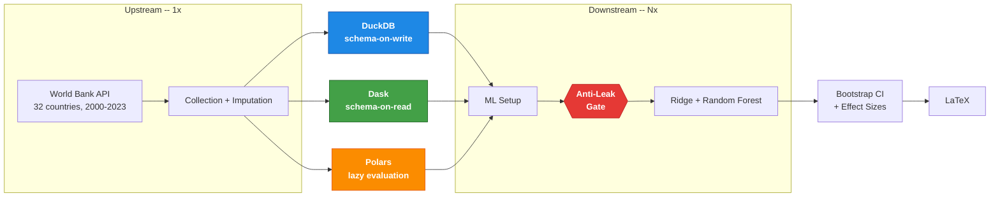

# rampart-framework

Framework for reproducible benchmarking of data architectures with automatic temporal anti-leakage checking. It compares DuckDB, Dask and Polars processing the same data and models, checking whether the pipelines produce bitwise-identical predictions (Δ=0.0) as a negative validation of ETL integrity.

## Quickstart

Requirements: Python 3.10+, 8 GB RAM, internet access (collects data from the World Bank API, no API key).

```bash
git clone https://github.com/DATA-UFMS/rampart-framework.git
cd rampart-framework
python -m venv .venv && source .venv/bin/activate
pip install -r requirements.txt

python pipeline.py                        # World Bank (default)
python pipeline.py --dataset inep_censo   # INEP Censo Escolar
pytest tests/                             # unit tests
```

The pipeline writes artifacts to `outputs/<dataset>/`: temporal folds, benchmark
metrics (CSV/JSON) and LaTeX tables. The root is separated by dataset, so that
running the second one does not overwrite the first.

### Verified reproduction

The path above assumes you know the sequence. This one does not:

```bash
scripts/reproduce.sh                          # World Bank
scripts/reproduce.sh --dataset inep_censo     # INEP
```

It installs from `requirements-lock.txt`, checks that the declared core budget
fits on the machine **before** starting, and runs the pipeline and the test suite.

In a container, with the base image pinned by digest:

```bash
docker build -t rampart .
docker run --rm rampart bash scripts/reproduce.sh
```

**Data snapshot.** Collection reads an external API whose values are revised, and
without this a difference between runs is indistinguishable from a code change.
A hashed snapshot separates the two, and removes the need for network access:

```bash
python scripts/verify_data_snapshot.py --snapshot data/ --dataset worldbank --record
scripts/reproduce.sh --data-snapshot data/
```

**Core budget.** Each paradigm receives the same number of cores
(`engine_threads`), and the numerical libraries under scikit-learn run with a
single thread (`blas_threads`) — they are the component common to all three, and
letting them size themselves to the machine made part of the measured difference be thread contention.
Every published latency is conditional on these values, which are kept in the snapshot.

**Run cost.** The benchmark stage dominates total time: it re-runs the setup,
baseline and hierarchical phases of the three paradigms `warmup + n` times (by default 2 + 10 = 12
full passes). Collection and processing caches only reduce the upstream stages, not the
benchmark. In practice, World Bank takes about an hour and a half and INEP Censo Escolar
takes over a day on the reference machine. That machine has to accommodate the
budget: `pipeline.py` refuses to run when `engine_threads + blas_threads
- 1` exceeds the available cores, which with the current values means eight
cores at minimum. For an exploratory run, reduce `repetitions` in
`src/core/config.py` — aware that this does not reproduce the latency table.

## What it does



The same World Bank data (school dropout, 32 countries, 2000–2023) is processed in three backends — **DuckDB** (analytical SQL), **Dask** (distributed DataFrames) and **Polars** (lazy evaluation) — and feeds the same models (hierarchical Ridge + Random Forest). An **anti-leakage gate** validates temporal integrity before each model run; if any fold violates the guarantees, the pipeline stops with `ValueError`.

The statistical comparison uses SESOI (smallest effect size of interest) with bootstrap 95% CI, complemented by paired Wilcoxon and Hodges–Lehmann. The goal is to test whether the choice of processing paradigm introduces bias in the results — the contribution is the protocol, not the predictive result.

Evaluated on two datasets (World Bank: 32 countries × 24 years, complete panel of 768 cell-years; INEP: 5,564 municipalities, 94K), the framework confirms bitwise predictive equivalence across the three paradigms and reveals a scale-dependent crossover: in-process engines dominate the small panel, while the task scheduler wins the ML phases on the large panel, via `persist()` caching across folds. The factors are not transcribed here — each run regenerates them in `statistics/architectural_latency_percentiles.json` and in the table derived by `scripts/derive_paper_tables.py`, conditional on the commit and the core budget stated in the caption. The complete panel is not the analyzed n: rows without an observed target are removed, and the count that remains is in `target_coverage.json`, together with the observed and imputed fractions per column.

## Anti-leakage (P1–P5)

The pipeline applies 5 automatic checks across all paradigms:

| Protocol | Check | Enforcement | Where |
|-----------|------------|-------------|------|
| P1 | Temporal ordering of the splits | `AntiLeakageViolation` at runtime | `TemporalValidator.enforce_walk_forward` |
| P2 | Minimum 2-year gap between splits | `AntiLeakageViolation` at runtime | `TemporalValidator.enforce_walk_forward` |
| P3 | Separation of features, proxy and joint reconstruction | `AntiLeakageViolation` at runtime; the post-lag re-audit, by receipt | `run_feature_selection`, `audit_feature_set` |
| P4 | Feature selection restricted to the training window of the first fold | `AntiLeakageViolation` at runtime | `BaseArchitectureML._first_fold_train_end` |
| P5 | Scaling and imputation fitted on the training set only | imputation: `AntiLeakageViolation` by receipt, at the end of the hierarchical stage; scaling: by construction, no receipt | `impute_from_training_window`, `canonical_fold` |

P1, P2 and P4 are enforced by the base class: they live inside concrete methods
that the setup skeleton calls, so a paradigm does not reach the models without
going through them. P5 and the P3 re-audit cannot be — they need the
materialized fold, which is precisely what each paradigm builds in a different
way. They run in the model code, and what the core guaranteed about them was
that the author had remembered to call them.

The receipt gate closes this from the other side: each call leaves an artifact, and
`_validate_protocol_receipts` stops execution when the receipt is missing, is
empty, or carries the identifier of another run. A new paradigm that omits
either of the two calls stops the pipeline instead of reporting results
under a protocol it did not follow.

The binding to the run is a nonce in `RAMPART_RUN_ID`, and not a clock
comparison. The temporal gate can compare timestamps because it runs minutes after the
start; this one runs hours later, and in that window an NTP adjustment backwards would make
a new receipt look old and abort the run. The nonce is also the stronger
test: a foreign receipt with a *more recent* timestamp would pass the clock
comparison and does not pass this one.

An empty fold set, folds that differ across paradigms, and a column with no
observation at all in the training window also stop the run — each was, at
some point, a case that passed in silence.

**What P1–P5 do not cover, and why.** The Kapoor & Narayanan taxonomy has
eight types. Five are enforced here; two require an argument from the author and not
code — L3.2 (the same entity in training and test, legitimate for panel
forecasting but a scientific claim) and L3.3 (rows without an observed target are
removed, and target absence is not random). The third, L2, is tracked and
not settled: K&N do not subdivide that category because the judgment requires
domain knowledge.

`scripts/derive_model_info_sheet.py` emits the model info sheet with the derivable
answers read from the artifacts and the three above flagged as requiring an
argument. This addresses the limitation the authors themselves state about the
instrument: *the claims of an info sheet cannot be verified in the
absence of computational reproducibility*. The contribution is not to extend the
taxonomy — it is to derive the answers instead of asserting them, and to guarantee that each
check gives the same verdict across the three paradigms, which a taxonomy
written for one implementation does not need to require.

The comparison against the naive baseline enters for the same reason: it is the method of
their case study, and it is what measures whether the task is trivial — the risk L2
leaves open when a feature is legitimately available but makes the
prediction easy.

Validation uses temporal walk-forward: training always grows forward in time, with a 2-year gap between splits. It produces 9 folds on WB (window train=8yr, val=2yr, test=2yr over 24 years) and 8 folds on INEP (window train=5yr, val=1yr, test=1yr over 18 years).

Temporal ordering (P1) is category L3.1 of Kapoor & Narayanan (2023). The **gap** is not: their taxonomy does not mention gaps anywhere. It mitigates L3.2 — dependence between training and test, here temporal autocorrelation — by way of blocked cross-validation with a buffer (Roberts et al., 2017, which is the reference K&N themselves cite in L3.2), with the embargo variant of López de Prado (2018).

## Structure

```
src/
├── core/
│   ├── base_architecture.py    # Abstract class (Template Method)
│   ├── paradigm_registry.py    # Auto-discovery via __init_subclass__
│   ├── validation.py           # TemporalValidator + DataIntegrityValidator
│   ├── scientific_config.py    # Centralized parameters (gaps, SESOI, seeds)
│   ├── dataset_config.py       # Protocol + dataset registry
│   ├── config.py               # Paths, countries, general settings
│   ├── indicators.py           # World Bank indicators
│   ├── logging_config.py       # Structured logging
│   └── models/baseline.py      # Baseline models (Ridge, RF)
├── collection/
│   ├── raw_data_collector.py   # World Bank API collection
│   ├── inep_collector.py       # INEP Censo Escolar collection
│   ├── task_graph/             # Dask processor (task-graph)
│   ├── sql_engine/             # DuckDB processor (SQL)
│   └── dataframe_lib/          # Polars processor (DataFrame)
├── datasets/
│   ├── worldbank.py            # World Bank config (32 countries, 2000-2023)
│   └── inep_censo.py           # INEP config (5,564 municipalities, 2007-2024)
├── architectures_ml/           # Setup + models per paradigm
│   ├── task_graph/
│   ├── sql_engine/
│   └── dataframe_lib/
├── benchmarking/               # Instrumentation and latency metrics
└── statistical_validation/     # Equivalence, bootstrap, effect sizes
tests/                          # 1544 tests (unit, discovery, anti-leakage)
pipeline.py                     # Orchestrates the full pipeline
```

### Outputs

```
outputs/
├── collection/                 # Raw and processed data per paradigm
├── ml_pipeline/architectures/  # Folds, features, model results
├── benchmarks/                 # CSV + JSONL of latency and resource usage
└── statistics/                 # Effect sizes, significance, LaTeX scorecard
```

## Extension

### New paradigm

Create a subclass of `BaseArchitectureML` with `PARADIGM_META` defined. Discovery is automatic via `__init_subclass__`: no orchestration, analysis or statistics module needs to be edited — they all derive from the registry.

P1, P2 and P4 are inherited from the base class. The P5 imputation and the P3 re-audit are not: they run over the materialized fold, which is what the paradigm implements, so it falls to the paradigm's model to call them. Forgetting does not pass in silence — the receipt gate requires the evidence of both at the end of the hierarchical stage and stops without it.

```python
# src/architectures_ml/my_paradigm/setup.py
class MeuParadigmaML(BaseArchitectureML):
    PARADIGM_META = {
        'name': 'my_paradigm',
        'label': 'My Paradigm',
        'baseline_class': ...,
        'baseline_module': ...,
        'baseline_results_json': ...,
        'baseline_script': ...,
        'hierarchical_class': ...,
        'hierarchical_module': ...,
        'hierarchical_script': ...,
        'master_artifact': ...,
        'processor_class': ...,
        'processor_module': ...,
        'processor_run_method': ...,
        'processor_script': ...,
        'setup_script': ...
    }

    # Abstract methods to implement (11):
    #   _compute_target_statistics
    #   _validate_temporal_folds
    #   apply_collinearity_filter
    #   compute_feature_correlations
    #   create_target_implementation
    #   discover_numeric_columns
    #   load_data
    #   prepare_features
    #   save_folds
    #   setup_environment
    #   validate_data
```

`get_numeric_features` is **not** on that list, and overriding it makes the
suite fail by design: the candidate pool has to be identical across
paradigms, otherwise the comparison starts from different search spaces. What
decides which columns are numeric in a given engine is `discover_numeric_columns`;
the exclusion policy lives in the base class, once only.

### New dataset

The framework supports multiple datasets via `DatasetConfig`. It already includes World Bank (32 countries) and INEP Censo Escolar (5,564 Brazilian municipalities):

```bash
python pipeline.py                        # World Bank (default)
python pipeline.py --dataset inep_censo   # INEP
```

To add a dataset, implement a `DatasetConfig` in `src/datasets/` and a collector in `src/collection/`. The adapter pattern converts data to the internal schema (`country_code`, `year`, numeric features) without modifying processors or models.

### Parameters

Edit `src/core/scientific_config.py`: temporal gaps, SESOI thresholds, embargo, bootstrap iterations, seed.

### Metrics

Extend `src/benchmarking/` or `src/statistical_validation/` following the JSON → LaTeX pattern.

## Methodological decisions

- **Walk-forward with gap=2 years** produces 9 folds on WB and 8 on INEP, the maximum without compromising anti-leakage in each temporal span. Observed latency effects are large (Cohen's d_z > 7); the primary decision uses bootstrap CI and Wilcoxon is a complement (Lakens et al., 2018).
- **Benchmark fairness**: DW/DL/PL order randomized per iteration (seed=42), `gc.collect()` between phases, identical feature set across paradigms.
- **Upstream runs 1x** (collection + processing produce deterministic data); **downstream runs Nx** (setup + models are the benchmark target).

## Reproducibility

- Seeds centralized in `scientific_config.py`, `n_jobs=1`
- Environment snapshot: packages, hardware, git commit
- `requirements-lock.txt` with exact versions
- 1544 automated tests (`pytest tests/`)

For operational details, see [`USAGE_GUIDE.md`](USAGE_GUIDE.md).

---

**Contact**: Eos Xavier (eos.xavier@ufms.br)
