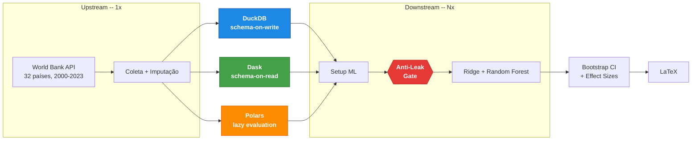

# archbench-framework

Framework para benchmarking reprodutível de arquiteturas de dados com verificação automática de anti-leakage temporal. Compara DuckDB, Dask e Polars processando os mesmos dados e modelos, verificando se os resultados preditivos são estatisticamente equivalentes.

## Quickstart

Requisitos: Python 3.10+, 8 GB RAM, acesso à internet (coleta dados da World Bank API, sem API key).

```bash
git clone https://github.com/anonymous/archbench-framework.git
cd archbench-framework
python -m venv .venv && source .venv/bin/activate
pip install -r requirements.txt

python pipeline.py          # ~20 min na primeira execução (coleta + processamento + benchmark)
pytest tests/               # 79 testes, ~2s
```

O pipeline gera artefatos em `outputs/`: folds temporais, métricas de benchmark (CSV/JSON) e tabelas LaTeX. Execuções subsequentes usam cache e levam ~5 min.

## O que faz



Os mesmos dados do Banco Mundial (evasão escolar, 32 países, 2000–2023) são processados em três backends — **DuckDB** (SQL analítico), **Dask** (DataFrames distribuídos) e **Polars** (lazy evaluation) — e alimentam os mesmos modelos (Ridge hierárquico + Random Forest). Um **gate anti-leakage** valida integridade temporal antes de cada execução de modelo; se qualquer fold violar as garantias, o pipeline interrompe com `ValueError`.

A comparação estatística usa SESOI (menor efeito de interesse prático) com IC 95% por bootstrap, complementada por Wilcoxon pareado e Hodges–Lehmann. O objetivo é testar se a escolha de paradigma de processamento introduz viés nos resultados — a contribuição é o protocolo, não o resultado preditivo.

## Anti-leakage (P1–P5)

O pipeline aplica 5 verificações automáticas em todos os paradigmas:

| Protocolo | Verificação | Enforcement |
|-----------|------------|-------------|
| P1 | Ordenação temporal dos splits | `ValueError` em runtime |
| P2 | Gap mínimo de 2 anos entre splits | `ValueError` em runtime |
| P3 | Separação de features + detecção de proxy | `ValueError` em runtime |
| P4 | Feature selection restrita ao treino | `ValueError` em runtime |
| P5 | Scaling/imputação ajustados só no treino | Contrato + testes unitários |

A validação usa walk-forward temporal: o treino sempre cresce para frente no tempo, com gap de 2 anos entre treino/validação e validação/teste, garantindo que nenhuma informação futura contamine o modelo. Isso produz 9 folds ao longo de 23 anos de dados (Kapoor & Narayanan, 2023).

## Estrutura

```
src/
├── core/
│   ├── base_architecture.py    # Classe abstrata (Template Method)
│   ├── paradigm_registry.py    # Auto-descoberta via __init_subclass__
│   ├── validation.py           # TemporalValidator + DataIntegrityValidator
│   ├── scientific_config.py    # Parâmetros centralizados (gaps, SESOI, seeds)
│   ├── dataset_config.py       # Protocol + registry de datasets
│   ├── config.py               # Paths, países, configurações gerais
│   ├── indicators.py           # Indicadores World Bank
│   ├── logging_config.py       # Logging estruturado
│   └── models/baseline.py      # Modelos baseline (Ridge, RF)
├── collection/
│   ├── raw_data_collector.py   # Coleta World Bank API
│   ├── inep_collector.py       # Coleta INEP Censo Escolar
│   ├── data_lake/              # Processador Dask
│   ├── data_warehouse/         # Processador DuckDB
│   └── polars_dataframe/       # Processador Polars
├── datasets/
│   ├── worldbank.py            # Config World Bank (32 países, 2000-2023)
│   └── inep_censo.py           # Config INEP (5570 municípios, 2007-2024)
├── architectures_ml/           # Setup + modelos por paradigma
│   ├── data_lake/
│   ├── data_warehouse/
│   └── polars_dataframe/
├── benchmarking/               # Instrumentação e métricas de latência
└── statistical_validation/     # Equivalência, bootstrap, effect sizes
tests/                          # 79 testes (unitários, discovery, anti-leakage)
pipeline.py                     # Orquestra o pipeline completo
```

### Outputs

```
outputs/
├── collection/                 # Dados brutos e processados por paradigma
├── ml_pipeline/architectures/  # Folds, features, resultados de modelos
├── benchmarks/                 # CSV + JSONL de latência e uso de recursos
└── statistics/                 # Effect sizes, significância, scorecard LaTeX
```

## Extensão

### Novo paradigma

Crie uma subclasse de `BaseArchitectureML` com `PARADIGM_META` definido. O framework descobre automaticamente via `__init_subclass__` — nenhum arquivo existente precisa ser editado. As verificações anti-leakage são herdadas.

```python
# src/architectures_ml/meu_paradigma/setup.py
class MeuParadigmaML(BaseArchitectureML):
    PARADIGM_META = {
        'name': 'meu_paradigma',
        'label': 'Meu Paradigma',
        'setup_script': 'src/architectures_ml/meu_paradigma/setup.py',
        # ... módulos de processamento, baseline e hierárquico
    }
    # Implementar métodos abstratos: setup_environment, load_data,
    # validate_data, create_target_implementation, save_folds,
    # compute_feature_correlations, apply_collinearity_filter,
    # get_numeric_features, prepare_features, entre outros.
```

### Novo dataset

O framework suporta múltiplos datasets via `DatasetConfig`. Já inclui World Bank (32 países) e INEP Censo Escolar (5570 municípios brasileiros):

```bash
python pipeline.py                        # World Bank (default)
python pipeline.py --dataset inep_censo   # INEP
```

Para adicionar um dataset, implemente um `DatasetConfig` em `src/datasets/` e um coletor em `src/collection/`. O adapter pattern converte dados para o schema interno (`country_code`, `year`, features numéricas) sem modificar processadores ou modelos.

### Parâmetros

Edite `src/core/scientific_config.py`: gaps temporais, limiares SESOI, embargo, bootstrap iterations, seed.

### Métricas

Estenda `src/benchmarking/` ou `src/statistical_validation/` seguindo o padrão JSON → LaTeX.

## Decisões metodológicas

- **Walk-forward com gap=2 anos** produz 9 folds, o máximo sem comprometer anti-leakage. Isso limita o poder do Wilcoxon pareado (~30% para efeitos médios); por isso a decisão primária usa bootstrap CI e o Wilcoxon é complemento (Lakens et al., 2018).
- **Fairness no benchmark**: ordem DW/DL/PL randomizada por iteração (seed=42), `gc.collect()` entre fases, feature set idêntico entre paradigmas.
- **Upstream executa 1x** (coleta + processamento produzem dados determinísticos); **downstream executa Nx** (setup + modelos são o alvo do benchmark).

## Reprodutibilidade

- Seeds centralizadas em `scientific_config.py`, `n_jobs=1`
- Snapshot de ambiente: packages, hardware, git commit
- `requirements-lock.txt` com versões exatas
- 79 testes automatizados (`pytest tests/`)

Para detalhes operacionais, veja o [`USAGE_GUIDE.md`](USAGE_GUIDE.md).

---

**Contato**: [Removido para revisão double-blind]
