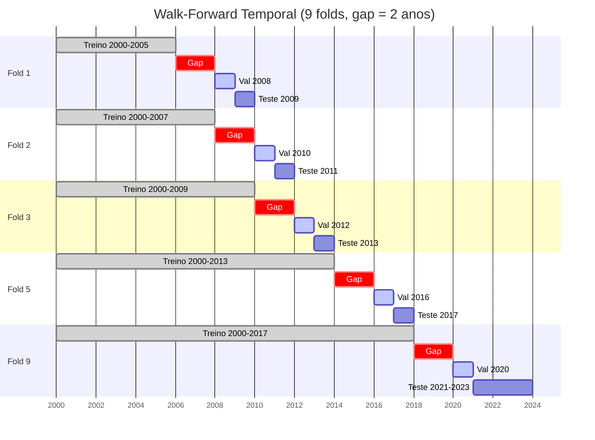

# dw-vs-dl-dropout-prediction-latam

Framework open-source para benchmarking reprodutível de arquiteturas de dados, comparando **três paradigmas** (DuckDB, Dask, Polars), com **verificação automática de anti-leakage temporal**.


## O problema

Leakage temporal é uma das principais causas de resultados irreplicáveis em machine learning aplicado a educação. Kapoor & Narayanan (2023) auditaram 294 papers e encontraram leakage em uma parcela significativa deles. Em analytics educacional, o cenário é agravado pela escassez de validação temporal rigorosa e pela ausência de ferramentas que automatizem essa verificação.

## O que este repositório faz

Este framework fornece um **protocolo reutilizável de benchmarking com verificação anti-leakage** para pipelines de ML, demonstrado com dados públicos do Banco Mundial (32 países, 2000-2023) para predição de evasão escolar. A contribuição principal é o protocolo, não o resultado preditivo.

Como caso de uso, o pipeline processa os mesmos dados em três fluxos de processamento distintos — **DuckDB** (SQL analítico, schema-on-write), **Dask** (DataFrames distribuídos, schema-on-read) e **Polars** (lazy evaluation, schema-on-read) — e verifica se o resultado preditivo é estatisticamente equivalente independente do backend. Isso testa se a escolha de paradigma de processamento introduz viés nos resultados de ML, uma pergunta que a literatura de analytics educacional não aborda sistematicamente.

O pipeline executa coleta, processamento, treinamento e benchmark de ponta a ponta, com um **gate anti-leakage** que interrompe a execução se qualquer fold violar integridade temporal. Inclui testes de injeção que deliberadamente tentam quebrar o gate para provar que ele funciona.

### Por que três paradigmas?

A comparação original (DuckDB vs Dask) cobria os extremos do espectro: SQL analítico in-process versus DataFrames distribuídos. Polars ocupa um nicho intermediário — lazy evaluation single-machine com otimização de query plan, sem overhead de coordenação distribuída (Dask) e sem linguagem SQL (DuckDB). Isso permite testar se a equivalência preditiva se mantém não apenas entre extremos, mas também em um paradigma que combina características de ambos: schema-on-read como o Data Lake, mas execução in-process como o Data Warehouse. Com N=3 paradigmas, a generalização da tese ("a arquitetura de processamento não introduz viés nos resultados de ML") é mais robusta do que com N=2.

### Walk-forward temporal

O framework usa validação walk-forward com gaps de 2 anos entre treino e teste, garantindo que nenhuma informação futura contamine o modelo. O diagrama abaixo mostra como os 9 folds se distribuem ao longo de 23 anos de dados:



### Protocolo anti-leakage (P1-P5)


### DuckDB vs Dask vs Polars: o que cada um faz


### Benchmark (Azure L4as_v4, 32 GB RAM, n=30)

```mermaid
---
config:
  themeVariables:
    xyChart:
      backgroundColor: transparent
---
xychart-beta
    title "Latência por fase: DuckDB vs Dask vs Polars (segundos)"
    x-axis ["Setup", "Processing", "Baseline", "Hierarchical"]
    y-axis "Tempo (s)" 0 --> 200
    bar [0.41, 0.18, 1.19, 15.25]
    bar [179.01, 0.90, 7.79, 16.96]
    bar [0.054, 0.016, 1.08, 15.38]
```



> DuckDB (azul) vs Dask (verde) vs Polars (laranja). Setup: **437x** (DW vs DL), **3315x** (PL vs DL). Baseline: **7x** (DW vs DL), **7x** (PL vs DL). Hierarchical: **~1.1x** (todos). Total: DuckDB 17.02 s, Dask 204.66 s, Polars 16.53 s — **DW 12x mais rápido** e **PL 12x mais rápido** que DL.

### Garantias do pipeline

- **Anti-leakage automático (P1-P5)** em todas as 3 arquiteturas — ordenação temporal (P1), gap mínimo de 2 anos (P2), separação de features e detecção de proxy (P3), escopo temporal da seleção de features (P4), e escopo de preprocessing com scaling/imputação ajustados exclusivamente no treino (P5). Violações de P1-P4 geram `ValueError` e interrompem a execução; P5 é enforced por contrato e testes unitários. Cobre as categorias L1.1-L1.4, L2 e L3.2 da taxonomia de Kapoor & Narayanan (2023) e as 4 variantes de Semmelrock et al. (2025).
- **HPO sem contaminação** — hiperparâmetros selecionados via grid search no conjunto de validação; modelo final retreinado no treino completo. Previne leakage L3.3.
- **Equivalência estatística, não p-hacking** — comparação arquitetural via SESOI + IC 95% por bootstrap, com Wilcoxon e Hodges-Lehmann como suporte. Limiares SESOI definidos a priori: R² = 0.01 (metade do efeito pequeno de Cohen 1988), MASE = 0.05, WAPE = 0.05 (resolução prática de decisão, Lakens et al. 2018).
- **Reprodutibilidade integral** — seeds centralizadas, `n_jobs=1`, snapshot de ambiente (packages, hardware, git commit) e 73 testes automatizados.
- **Extensível por design** — `BaseArchitectureML` (11 métodos abstratos, Template Method) com auto-descoberta de paradigmas via `__init_subclass__`; novas arquiteturas são registradas automaticamente ao serem importadas, sem editar código existente.

### Limitações explícitas

Os dados são macro-educacionais (agregados por país/ano), não logs individuais de alunos. O walk-forward com gaps de 2 anos produz n=9 folds, o máximo sem comprometer o anti-leakage temporal. Isso limita o poder do Wilcoxon pareado (~30% para efeitos médios), por isso a decisão primária usa bootstrap CI e o Wilcoxon é complemento de robustez. Um resultado "inconclusivo" é esperado e reflete a precisão disponível, não falha metodológica (Lakens et al. 2018). Expomos essas limitações deliberadamente.

## Quickstart

```bash
git clone https://github.com/DATA-UFMS/dw-vs-dl-dropout-prediction-latam.git
cd dw-vs-dl-dropout-prediction-latam
python -m venv .venv && source .venv/bin/activate
pip install -r requirements.txt

# Pipeline completo: coleta → validação → benchmark → artefatos LaTeX (3 arquiteturas: DW, DL, PL)
python pipeline.py

# Testes (73 testes: unitários + framework discovery + injeção de leakage)
pytest tests/
```

O pipeline gera todos os artefatos em `outputs/` — folds temporais, resultados de benchmark, tabelas LaTeX publication-ready e um snapshot completo do ambiente para replicação.

## Estrutura do projeto

```
src/
├── core/                    # Base do framework
│   ├── base_architecture.py # Classe abstrata (Template Method, 11 métodos)
│   ├── paradigm_registry.py # Auto-descoberta de paradigmas via __init_subclass__
│   ├── validation.py        # TemporalValidator + DataIntegrityValidator
│   ├── scientific_config.py # Parâmetros centralizados (gaps, SESOI, seeds)
│   └── models/baseline.py   # Estratégias RF, XGBoost, LightGBM
├── collection/              # Coleta e processamento de dados brutos
│   ├── raw_data_collector.py
│   ├── data_lake/           # Processador Dask (schema-on-read)
│   ├── data_warehouse/      # Processador DuckDB (schema-on-write)
│   └── polars_dataframe/    # Processador Polars (lazy evaluation)
├── architectures_ml/        # Implementações por arquitetura
│   ├── data_lake/           # Setup ML + modelos hierárquicos (Ridge, RF)
│   ├── data_warehouse/      # Setup ML + modelos hierárquicos (Ridge, RF)
│   └── polars_dataframe/    # Setup ML + modelos hierárquicos (Ridge, RF)
├── benchmarking/            # Instrumentação e derivação de métricas
└── statistical_validation/  # TOST, bootstrap, effect sizes, scorecard
tests/
├── test_unit_core.py        # Testes unitários
├── test_framework_discovery.py # Testes de auto-descoberta de paradigmas
├── test_lag_anti_leak.py    # Testes de integridade temporal
└── test_leakage_injection.py # Validação negativa do gate (S1–S4)
pipeline.py                  # Orquestra tudo
```

## Como adaptar para seu domínio

1. **Nova arquitetura** — crie uma subclasse de `BaseArchitectureML` em `src/architectures_ml/<novo>/setup.py` com `PARADIGM_META` definido. O framework descobre automaticamente via `__init_subclass__` — nenhum arquivo existente precisa ser editado. Polars foi adicionado seguindo este padrão.

2. **Novos parâmetros** — edite `src/core/scientific_config.py`: gaps temporais, limiares SESOI (`sesoi_r2`, `sesoi_mase`, `sesoi_wape`), embargo, bootstrap iterations.

3. **Novas métricas** — estenda `src/benchmarking/` ou `src/statistical_validation/` seguindo o padrão de entrada/saída JSON → LaTeX dos scripts existentes.

4. **Outro domínio** — ajuste os indicadores no coletor de dados e os limiares SESOI. Os protocolos permanecem os mesmos.

Para detalhes operacionais, veja o [`USAGE_GUIDE.md`](USAGE_GUIDE.md). O fluxo completo do pipeline está em [`docs/pipeline_diagram.md`](docs/pipeline_diagram.md).

---

**Contato**: {eos.xavier, rosa.livia, vanessa.a.borges}@ufms.br — Faculdade de Computação, UFMS.
