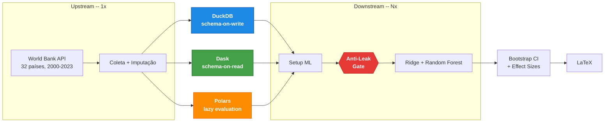

# rampart-framework

Framework para benchmarking reprodutível de arquiteturas de dados com verificação automática de anti-leakage temporal. Compara DuckDB, Dask e Polars processando os mesmos dados e modelos, verificando se os pipelines produzem predições bitwise-idênticas (Δ=0.0) como validação negativa da integridade de ETL.

## Quickstart

Requisitos: Python 3.10+, 8 GB RAM, acesso à internet (coleta dados da World Bank API, sem API key).

```bash
git clone https://github.com/DATA-UFMS/rampart-framework.git
cd rampart-framework
python -m venv .venv && source .venv/bin/activate
pip install -r requirements.txt

python pipeline.py                        # World Bank (default)
python pipeline.py --dataset inep_censo   # INEP Censo Escolar
pytest tests/                             # testes unitários
```

O pipeline gera artefatos em `outputs/<dataset>/`: folds temporais, métricas de
benchmark (CSV/JSON) e tabelas LaTeX. A raiz é separada por dataset, de modo que
executar o segundo não sobrescreve o primeiro.

### Reprodução verificada

O caminho acima assume que se conhece a sequência. Este não:

```bash
scripts/reproduce.sh                          # World Bank
scripts/reproduce.sh --dataset inep_censo     # INEP
```

Instala a partir de `requirements-lock.txt`, verifica que o orçamento de núcleos
declarado cabe na máquina **antes** de começar, roda o pipeline e a suíte.

Em contêiner, com a imagem base fixada por digest:

```bash
docker build -t rampart .
docker run --rm rampart bash scripts/reproduce.sh
```

**Snapshot de dados.** A coleta lê uma API externa cujos valores são revisados, e
sem isso uma diferença entre execuções é indistinguível de uma mudança de código.
Um snapshot com hash separa as duas coisas, e dispensa rede:

```bash
python scripts/verify_data_snapshot.py --snapshot dados/ --dataset worldbank --record
scripts/reproduce.sh --data-snapshot dados/
```

**Orçamento de núcleos.** Cada paradigma recebe o mesmo número de núcleos
(`engine_threads`), e as bibliotecas numéricas sob o scikit-learn rodam com uma
thread (`blas_threads`) — elas são o componente comum aos três, e deixá-las
dimensionar pela máquina fazia parte da diferença medida ser contenção de threads.
Toda latência publicada é condicional a esses valores, que ficam no snapshot.

**Custo de execução.** A etapa de benchmark domina o tempo total: ela reexecuta as fases de
setup, baseline e hierárquico dos três paradigmas `warmup + n` vezes (por padrão 2 + 10 = 12
passagens completas). Cache de coleta e processamento reduz apenas as etapas a montante, não o
benchmark. Na prática, o World Bank leva cerca de uma hora e meia e o INEP Censo Escolar
passa de um dia na máquina de referência. Essa máquina precisa comportar o
orçamento: `pipeline.py` recusa executar quando `engine_threads + blas_threads
- 1` excede os núcleos disponíveis, o que com os valores atuais significa oito
núcleos no mínimo. Para uma execução exploratória, reduza `repetitions` em
`src/core/config.py` — ciente de que isso não reproduz a tabela de latência.

## O que faz



Os mesmos dados do Banco Mundial (evasão escolar, 32 países, 2000–2023) são processados em três backends — **DuckDB** (SQL analítico), **Dask** (DataFrames distribuídos) e **Polars** (lazy evaluation) — e alimentam os mesmos modelos (Ridge hierárquico + Random Forest). Um **gate anti-leakage** valida integridade temporal antes de cada execução de modelo; se qualquer fold violar as garantias, o pipeline interrompe com `ValueError`.

A comparação estatística usa SESOI (menor efeito de interesse prático) com IC 95% por bootstrap, complementada por Wilcoxon pareado e Hodges–Lehmann. O objetivo é testar se a escolha de paradigma de processamento introduz viés nos resultados — a contribuição é o protocolo, não o resultado preditivo.

Avaliado em dois datasets (World Bank: 32 países × 24 anos, painel completo de 768 célula-ano; INEP: 5.564 municípios, 94K), o framework confirma equivalência preditiva bitwise nos três paradigmas e revela um crossover dependente de escala: engines in-process dominam o painel pequeno, enquanto o escalonador de tarefas vence as fases de ML no painel grande, via caching de `persist()` entre folds. Os fatores não são transcritos aqui — cada execução os regenera em `statistics/architectural_latency_percentiles.json` e na tabela derivada por `scripts/derive_paper_tables.py`, condicionados ao commit e ao orçamento de núcleos que constam da legenda. O painel completo não é o n analisado: linhas sem alvo observado são removidas, e a contagem que sobra fica em `target_coverage.json`, junto das frações observada e imputada por coluna.

## Anti-leakage (P1–P5)

O pipeline aplica 5 verificações automáticas em todos os paradigmas:

| Protocolo | Verificação | Enforcement | Onde |
|-----------|------------|-------------|------|
| P1 | Ordenação temporal dos splits | `AntiLeakageViolation` em runtime | `TemporalValidator.enforce_walk_forward` |
| P2 | Gap mínimo de 2 anos entre splits | `AntiLeakageViolation` em runtime | `TemporalValidator.enforce_walk_forward` |
| P3 | Separação de features, proxy e reconstrução conjunta | `AntiLeakageViolation` em runtime | `audit_feature_set`, `run_feature_selection` |
| P4 | Feature selection restrita à janela de treino do primeiro fold | `AntiLeakageViolation` em runtime | `BaseArchitectureML._first_fold_train_end` |
| P5 | Scaling e imputação ajustados só no treino | `ValueError` em runtime + contrato | `impute_from_training_window`, `canonical_fold` |

Um conjunto de folds vazio, folds que diferem entre paradigmas, e uma coluna sem
nenhuma observação na janela de treino também interrompem — cada um foi, em
algum momento, um caso que passava em silêncio.

A validação usa walk-forward temporal: o treino sempre cresce para frente no tempo, com gap de 2 anos entre splits, garantindo que nenhuma informação futura contamine o modelo. Produz 9 folds em WB (janela train=8yr, val=2yr, test=2yr sobre 24 anos) e 8 folds em INEP (janela train=5yr, val=1yr, test=1yr sobre 18 anos). Referência: Kapoor & Narayanan (2023).

## Estrutura

```
src/
├── core/
│   ├── base_architecture.py    # Classe abstrata (Template Method)
│   ├── paradigm_registry.py    # Auto-descoberta via __init_subclass__
│   ├── validation.py           # TemporalValidator + DataIntegrityValidator
│   ├── scientific_config.py    # Parâmetros centralizados (gaps, SESOI, seeds)
│   ├── dataset_config.py       # Protocol + registry de datasets
│   ├── config.py               # Paths, países, configurações gerais
│   ├── indicators.py           # Indicadores World Bank
│   ├── logging_config.py       # Logging estruturado
│   └── models/baseline.py      # Modelos baseline (Ridge, RF)
├── collection/
│   ├── raw_data_collector.py   # Coleta World Bank API
│   ├── inep_collector.py       # Coleta INEP Censo Escolar
│   ├── task_graph/             # Processador Dask (task-graph)
│   ├── sql_engine/             # Processador DuckDB (SQL)
│   └── dataframe_lib/          # Processador Polars (DataFrame)
├── datasets/
│   ├── worldbank.py            # Config World Bank (32 países, 2000-2023)
│   └── inep_censo.py           # Config INEP (5.564 municípios, 2007-2024)
├── architectures_ml/           # Setup + modelos por paradigma
│   ├── task_graph/
│   ├── sql_engine/
│   └── dataframe_lib/
├── benchmarking/               # Instrumentação e métricas de latência
└── statistical_validation/     # Equivalência, bootstrap, effect sizes
tests/                          # 1415 testes (unitários, discovery, anti-leakage)
pipeline.py                     # Orquestra o pipeline completo
```

### Outputs

```
outputs/
├── collection/                 # Dados brutos e processados por paradigma
├── ml_pipeline/architectures/  # Folds, features, resultados de modelos
├── benchmarks/                 # CSV + JSONL de latência e uso de recursos
└── statistics/                 # Effect sizes, significância, scorecard LaTeX
```

## Extensão

### Novo paradigma

Crie uma subclasse de `BaseArchitectureML` com `PARADIGM_META` definido. O framework descobre automaticamente via `__init_subclass__` — nenhum arquivo existente precisa ser editado. As verificações anti-leakage são herdadas.

```python
# src/architectures_ml/meu_paradigma/setup.py
class MeuParadigmaML(BaseArchitectureML):
    PARADIGM_META = {
        'name': 'meu_paradigma',
        'label': 'Meu Paradigma',
        'baseline_class': ...,
        'baseline_module': ...,
        'baseline_results_json': ...,
        'baseline_script': ...,
        'hierarchical_class': ...,
        'hierarchical_module': ...,
        'hierarchical_script': ...,
        'master_artifact': ...,
        'processor_class': ...,
        'processor_module': ...,
        'processor_run_method': ...,
        'processor_script': ...,
        'setup_script': ...
    }

    # Métodos abstratos a implementar (11):
    #   _compute_target_statistics
    #   _validate_temporal_folds
    #   apply_collinearity_filter
    #   compute_feature_correlations
    #   create_target_implementation
    #   discover_numeric_columns
    #   load_data
    #   prepare_features
    #   save_folds
    #   setup_environment
    #   validate_data
```

`get_numeric_features` **não** entra nessa lista, e sobrescrevê-lo faz a
suíte falhar por desenho: o pool de candidatas tem de ser idêntico entre
paradigmas, senão a comparação parte de espaços de busca diferentes. Quem
decide quais colunas são numéricas naquele engine é `discover_numeric_columns`;
a política de exclusão fica na classe base, uma vez só.

### Novo dataset

O framework suporta múltiplos datasets via `DatasetConfig`. Já inclui World Bank (32 países) e INEP Censo Escolar (5.564 municípios brasileiros):

```bash
python pipeline.py                        # World Bank (default)
python pipeline.py --dataset inep_censo   # INEP
```

Para adicionar um dataset, implemente um `DatasetConfig` em `src/datasets/` e um coletor em `src/collection/`. O adapter pattern converte dados para o schema interno (`country_code`, `year`, features numéricas) sem modificar processadores ou modelos.

### Parâmetros

Edite `src/core/scientific_config.py`: gaps temporais, limiares SESOI, embargo, bootstrap iterations, seed.

### Métricas

Estenda `src/benchmarking/` ou `src/statistical_validation/` seguindo o padrão JSON → LaTeX.

## Decisões metodológicas

- **Walk-forward com gap=2 anos** produz 9 folds em WB e 8 em INEP, o máximo sem comprometer anti-leakage em cada span temporal. Efeitos de latência observados são grandes (Cohen's d_z > 7); a decisão primária usa bootstrap CI e o Wilcoxon é complemento (Lakens et al., 2018).
- **Fairness no benchmark**: ordem DW/DL/PL randomizada por iteração (seed=42), `gc.collect()` entre fases, feature set idêntico entre paradigmas.
- **Upstream executa 1x** (coleta + processamento produzem dados determinísticos); **downstream executa Nx** (setup + modelos são o alvo do benchmark).

## Reprodutibilidade

- Seeds centralizadas em `scientific_config.py`, `n_jobs=1`
- Snapshot de ambiente: packages, hardware, git commit
- `requirements-lock.txt` com versões exatas
- 1415 testes automatizados (`pytest tests/`)

Para detalhes operacionais, veja o [`USAGE_GUIDE.md`](USAGE_GUIDE.md).

---

**Contato**: Eos Xavier (eos.xavier@ufms.br)
