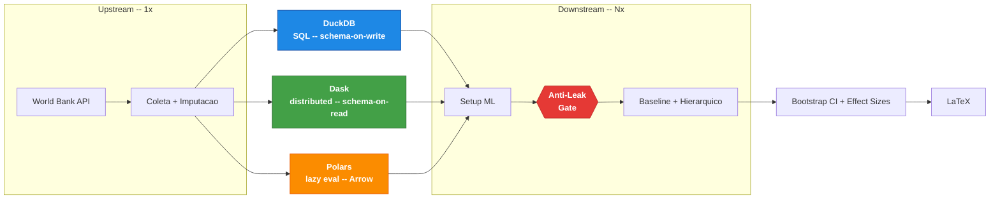
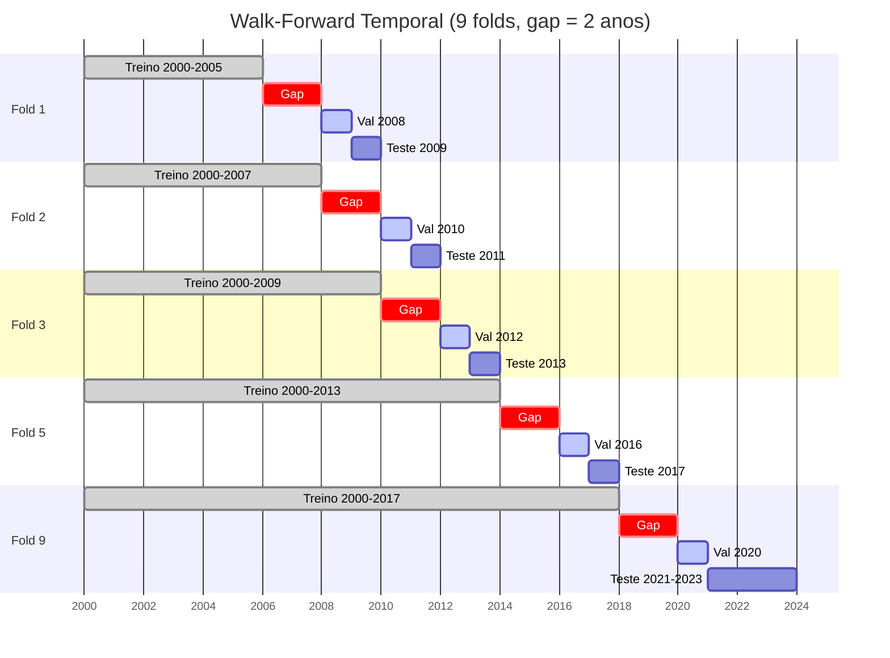
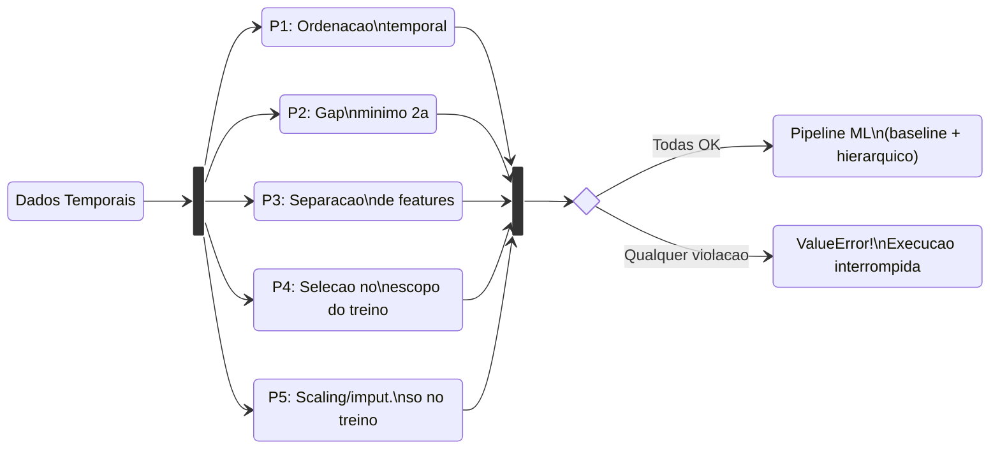
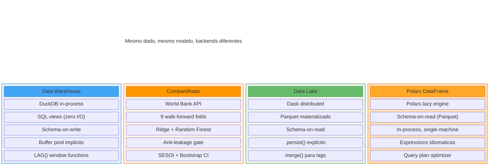

# dw-vs-dl-dropout-prediction-latam

Framework open-source para benchmarking reprodutivel de arquiteturas de dados, comparando **tres paradigmas** (DuckDB, Dask, Polars), com **verificacao automatica de anti-leakage temporal**.



## O problema

Leakage temporal e uma das principais causas de resultados irreplicaveis em machine learning aplicado a educacao. Kapoor & Narayanan (2023) auditaram 294 papers e encontraram leakage em uma parcela significativa deles. Em analytics educacional, o cenario e agravado pela escassez de validacao temporal rigorosa e pela ausencia de ferramentas que automatizem essa verificacao.

## O que este repositorio faz

Este framework fornece um **protocolo reutilizavel de benchmarking com verificacao anti-leakage** para pipelines de ML, demonstrado com dados publicos do Banco Mundial (32 paises, 2000-2023) para predicao de evasao escolar. A contribuicao principal e o protocolo, nao o resultado preditivo.

Como caso de uso, o pipeline processa os mesmos dados em tres fluxos de processamento distintos -- **DuckDB** (SQL analitico, schema-on-write), **Dask** (DataFrames distribuidos, schema-on-read) e **Polars** (lazy evaluation, schema-on-read) -- e verifica se o resultado preditivo e estatisticamente equivalente independente do backend. Isso testa se a escolha de paradigma de processamento introduz vies nos resultados de ML, uma pergunta que a literatura de analytics educacional nao aborda sistematicamente.

O pipeline executa coleta, processamento, treinamento e benchmark de ponta a ponta, com um **gate anti-leakage** que interrompe a execucao se qualquer fold violar integridade temporal. Inclui testes de injecao que deliberadamente tentam quebrar o gate para provar que ele funciona.

### Por que tres paradigmas?

A comparacao original (DuckDB vs Dask) cobria os extremos do espectro: SQL analitico in-process versus DataFrames distribuidos. Polars ocupa um nicho intermediario -- lazy evaluation single-machine com otimizacao de query plan, sem overhead de coordenacao distribuida (Dask) e sem linguagem SQL (DuckDB). Isso permite testar se a equivalencia preditiva se mantem nao apenas entre extremos, mas tambem em um paradigma que combina caracteristicas de ambos: schema-on-read como o Data Lake, mas execucao in-process como o Data Warehouse. Com N=3 paradigmas, a generalizacao da tese ("a arquitetura de processamento nao introduz vies nos resultados de ML") e mais robusta do que com N=2.

### Walk-forward temporal

O framework usa validacao walk-forward com gaps de 2 anos entre treino e teste, garantindo que nenhuma informacao futura contamine o modelo. O diagrama abaixo mostra como os 9 folds se distribuem ao longo de 23 anos de dados:



### Protocolo anti-leakage (P1-P5)



### DuckDB vs Dask vs Polars: o que cada um faz



### Separacao upstream / downstream

O benchmark separa o pipeline em duas camadas:

- **Upstream** (1x) -- coleta e processamento produzem dados deterministicos identicos em toda execucao. Repeti-los N vezes apenas desperdicaria tempo com chamadas HTTP e I/O sem adicionar informacao estatistica.

- **Downstream** (Nx) -- setup, baseline e hierarchical contem a logica arquitetural que diferencia os paradigmas. Sao repetidos N vezes para derivar intervalos de confianca e effect sizes.

### Garantias de fairness no benchmark

Cada iteracao do benchmark aplica 4 controles:

1. **Ordem randomizada** -- `random.Random(42)` decide a ordem DW/DL/PL a cada iteracao. Elimina vies sistematico de OS page cache.
2. **gc.collect()** -- garbage collection forcado entre cada execucao de arquitetura e entre fases. Evita que objetos residuais beneficiem ou prejudiquem a proxima.
3. **Feature set unificado** -- todas as arquiteturas entram no filtro de colinearidade com o mesmo conjunto base de features.
4. **Amostragem normalizada** -- a matriz de correlacao e computada sobre a mesma populacao de linhas completas em todos os paradigmas.

### Garantias do pipeline

- **Anti-leakage automatico (P1-P5)** em todas as 3 arquiteturas -- ordenacao temporal (P1), gap minimo de 2 anos (P2), separacao de features e deteccao de proxy (P3), escopo temporal da selecao de features (P4), e escopo de preprocessing com scaling/imputacao ajustados exclusivamente no treino (P5). Violacoes de P1-P4 geram `ValueError` e interrompem a execucao; P5 e enforced por contrato e testes unitarios. Cobre as principais categorias de leakage identificadas por Kapoor & Narayanan (2023).
- **HPO sem contaminacao** -- hiperparametros selecionados via grid search no conjunto de validacao; modelo final retreinado no treino completo. Previne leakage por otimizacao no conjunto de teste.
- **Equivalencia estatistica, nao p-hacking** -- comparacao arquitetural via SESOI + IC 95% por bootstrap, com Wilcoxon e Hodges-Lehmann como suporte. Limiares SESOI definidos a priori: R2 = 0.01, MASE = 0.05, WAPE = 0.05 (Lakens et al., 2018).
- **Reprodutibilidade integral** -- seeds centralizadas, `n_jobs=1`, snapshot de ambiente (packages, hardware, git commit) e 80 testes automatizados.
- **Extensivel por design** -- `BaseArchitectureML` (11 metodos abstratos, Template Method) com auto-descoberta de paradigmas via `__init_subclass__`; novas arquiteturas sao registradas automaticamente ao serem importadas, sem editar codigo existente.

### Limitacoes explicitas

Os dados sao macro-educacionais (agregados por pais/ano), nao logs individuais de alunos. O walk-forward com gaps de 2 anos produz n=9 folds, o maximo sem comprometer o anti-leakage temporal. Isso limita o poder do Wilcoxon pareado (~30% para efeitos medios), por isso a decisao primaria usa bootstrap CI e o Wilcoxon e complemento de robustez. Um resultado "inconclusivo" e esperado e reflete a precisao disponivel, nao falha metodologica (Lakens et al., 2018).

## Quickstart

```bash
git clone https://github.com/anonymous/dw-vs-dl-dropout-prediction-latam.git
cd dw-vs-dl-dropout-prediction-latam
python -m venv .venv && source .venv/bin/activate
pip install -r requirements.txt

# Pipeline completo: coleta -> validacao -> benchmark -> artefatos LaTeX
python pipeline.py

# Testes (80 testes)
pytest tests/
```

## Estrutura do projeto

```
src/
├── core/                    # Base do framework
│   ├── base_architecture.py # Classe abstrata (Template Method, 11 metodos)
│   ├── paradigm_registry.py # Auto-descoberta de paradigmas via __init_subclass__
│   ├── validation.py        # TemporalValidator + DataIntegrityValidator
│   ├── scientific_config.py # Parametros centralizados (gaps, SESOI, seeds)
│   └── models/baseline.py   # Estrategias de modelos baseline (Ridge, RF)
├── collection/              # Coleta e processamento de dados brutos
│   ├── raw_data_collector.py
│   ├── data_lake/           # Processador Dask (schema-on-read)
│   ├── data_warehouse/      # Processador DuckDB (schema-on-write)
│   └── polars_dataframe/    # Processador Polars (lazy evaluation)
├── architectures_ml/        # Implementacoes por arquitetura
│   ├── data_lake/           # Setup ML + modelos hierarquicos (Ridge, RF)
│   ├── data_warehouse/      # Setup ML + modelos hierarquicos (Ridge, RF)
│   └── polars_dataframe/    # Setup ML + modelos hierarquicos (Ridge, RF)
├── benchmarking/            # Instrumentacao e derivacao de metricas
└── statistical_validation/  # Equivalencia, bootstrap, effect sizes, scorecard
tests/
├── test_unit_core.py        # Testes unitarios (transforms, folds, anti-leakage)
├── test_framework_discovery.py # Testes de auto-descoberta de paradigmas
├── test_dataset_config.py   # Testes de configuracao de datasets
└── test_lag_anti_leak.py    # Testes de integridade temporal
pipeline.py                  # Orquestra tudo
```

### Estrutura de outputs

```
outputs/
├── collection/
│   ├── raw_data/                          # Dados brutos
│   ├── data_lake/                         # Parquet particionado (Dask)
│   ├── data_warehouse/                    # DuckDB + Parquet
│   └── polars_dataframe/                  # Parquet (Polars)
├── ml_pipeline/
│   └── architectures/
│       ├── data_lake/prep/                # Folds, features, modelos DL
│       ├── data_warehouse/prep/           # Folds, features, modelos DW
│       └── polars_dataframe/prep/         # Folds, features, modelos PL
├── benchmarks/
│   ├── architectural_benchmark_results.csv
│   ├── architectural_benchmark_resource_log.jsonl
│   └── architectural_benchmark_summary.json
└── statistics/
    ├── effect_sizes_summary.csv/json
    ├── significance_summary.csv/json
    ├── equivalence_estimation.json/tex
    └── architectural_scorecard.tex
```

## Como adaptar para seu dominio

1. **Nova arquitetura** -- crie uma subclasse de `BaseArchitectureML` em `src/architectures_ml/<novo>/setup.py` com `PARADIGM_META` definido. O framework descobre automaticamente via `__init_subclass__` -- nenhum arquivo existente precisa ser editado.

2. **Novos parametros** -- edite `src/core/scientific_config.py`: gaps temporais, limiares SESOI, embargo, bootstrap iterations.

3. **Novas metricas** -- estenda `src/benchmarking/` ou `src/statistical_validation/` seguindo o padrao de entrada/saida JSON -> LaTeX dos scripts existentes.

4. **Outro dominio** -- ajuste os indicadores no coletor de dados e os limiares SESOI. Os protocolos permanecem os mesmos.

Para detalhes operacionais, veja o [`USAGE_GUIDE.md`](USAGE_GUIDE.md).

---

**Contato**: [Removido para revisao double-blind]
