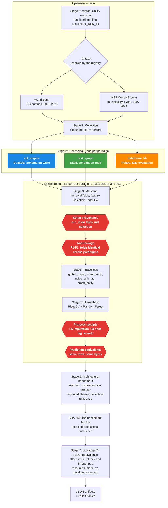

# rampart-framework

Framework for reproducible benchmarking of data architectures with automatic temporal anti-leakage checking. It compares DuckDB, Dask and Polars processing the same data and models, checking whether the pipelines produce bitwise-identical predictions (Δ=0.0) as a negative validation of ETL integrity.

## Quickstart

Requirements: Python 3.12, 8 GB RAM, internet access, no API key. The World
Bank dataset is collected from `api.worldbank.org`; the INEP one downloads the
yearly rate files from `download.inep.gov.br`.

```bash
git clone https://github.com/DATA-UFMS/rampart-framework.git
cd rampart-framework
python -m venv .venv && source .venv/bin/activate
pip install -r requirements.txt

python pipeline.py                        # World Bank (default)
python pipeline.py --dataset inep_censo   # INEP Censo Escolar
pytest tests/                             # unit tests
```

The pipeline writes artifacts to `outputs/<dataset>/`: temporal folds, benchmark
metrics (CSV/JSON) and LaTeX tables. The root is separated by dataset, so that
running the second one does not overwrite the first.

### Verified reproduction

The path above assumes you know the sequence. This one does not:

```bash
scripts/reproduce.sh                          # World Bank
scripts/reproduce.sh --dataset inep_censo     # INEP
```

It installs from `requirements-lock.txt`, checks that the declared core budget
fits on the machine **before** starting, and runs the pipeline and the test suite.

In a container, with the base image pinned by digest:

```bash
docker build -t rampart .
docker run --rm rampart bash scripts/reproduce.sh
```

**Data snapshot.** Collection reads an external API whose values are revised, and
without this a difference between runs is indistinguishable from a code change.
A hashed snapshot separates the two, and removes the need for network access:

```bash
python scripts/verify_data_snapshot.py --snapshot data/ --dataset worldbank --record
scripts/reproduce.sh --data-snapshot data/
```

**Core budget.** Each paradigm receives the same number of cores
(`engine_threads`), and the numerical libraries under scikit-learn run with a
single thread (`blas_threads`) — they are the component common to all three, and
letting them size themselves to the machine made part of the measured difference be thread contention.
Every published latency is conditional on these values, which are kept in the snapshot.

**Run cost.** The benchmark stage dominates total time: it re-runs the
processing, setup, baseline and hierarchical phases of the three paradigms
`warmup + n` times — by default 2 + 10 = 12 passes, so 144 measured phase
executions. Collection is the one phase it does not repeat: it runs once ahead
of the repetitions and is recorded under `run_id=-1` for reference, so the
collection cache shortens that single pass and nothing else. Everything the
benchmark measures is recomputed on every pass, which is what makes the latency
distribution a measurement rather than a reading of a cache. In practice, World Bank takes about an hour and a half and INEP Censo Escolar
takes over a day on the reference machine. That machine has to accommodate the
budget: `pipeline.py` refuses to run when `engine_threads + blas_threads
- 1` exceeds the available cores, which with the current values means eight
cores at minimum. For an exploratory run, reduce `repetitions` in
`src/core/config.py` — aware that this does not reproduce the latency table.

## What it does



The same data — the World Bank panel by default, INEP Censo Escolar with `--dataset inep_censo` — is processed in three backends: **DuckDB** (`sql_engine`, analytical SQL), **Dask** (`task_graph`, a task-graph scheduler) and **Polars** (`dataframe_lib`, lazy evaluation). All three feed the same models, a hierarchical Ridge and a Random Forest. **Four gates** stand between the stages: two after setup, checking that the fold artifacts belong to this run and that the folds satisfy P1–P2 and are identical across paradigms; two after the models, checking that P3's re-audit and P5's imputation actually ran and that the three paradigms predicted the same values for the same rows. Any of them failing stops the pipeline rather than annotating the output.

The statistical comparison uses SESOI (smallest effect size of interest) with bootstrap 95% CI, complemented by paired Wilcoxon and Hodges–Lehmann. The goal is to test whether the choice of processing paradigm introduces bias in the results — the contribution is the protocol, not the predictive result.

Evaluated on two datasets (World Bank: 32 countries × 24 years, complete panel of 768 cell-years; INEP: 5,564 municipalities, 94K), the framework confirms bitwise predictive equivalence across the three paradigms and reveals a scale-dependent crossover: in-process engines dominate the small panel, while the task scheduler wins the ML phases on the large panel, via `persist()` caching across folds. The factors are not transcribed here — each run regenerates them in `statistics/architectural_latency_percentiles.json` and in the table derived by `scripts/derive_paper_tables.py`, conditional on the commit and the core budget stated in the caption. The complete panel is not the analyzed n: rows without an observed target are removed, and the count that remains is in `target_coverage.json`, together with the observed and imputed fractions per column.

## Anti-leakage (P1–P5)

The pipeline applies five automatic checks across every paradigm, and four gates that verify the checks themselves ran:

| Protocol | Check | Enforcement | Where |
|-----------|------------|-------------|------|
| P1 | Temporal ordering of the splits | `AntiLeakageViolation` at runtime | `TemporalValidator.enforce_walk_forward` |
| P2 | Minimum 2-year gap between splits | `AntiLeakageViolation` at runtime | `TemporalValidator.enforce_walk_forward` |
| P3 | Feature separation, proxy ceiling, joint reconstruction and exact target reproduction | `AntiLeakageViolation` at runtime, in selection and again in the post-lag re-audit; that the re-audit ran at all is what the receipt establishes | `run_feature_selection`, `audit_feature_set` |
| P4 | Feature selection restricted to the training window of the first fold | by construction: the panel is filtered to `train_end` before any correlation is computed, so there is no violation left to raise on | `BaseArchitectureML._first_fold_train_end`, `run_feature_selection` |
| P5 | Scaling and imputation fitted on the training set only | imputation: `ValueError` at runtime for a column with no observation in the training window, and `AntiLeakageViolation` by receipt at the end of the hierarchical stage; scaling: by construction, no receipt | `impute_from_training_window`, and the `StandardScaler` fit that follows it in each paradigm's `hierarchical_model.py` |

P1, P2 and P4 are enforced by the base class: they live inside concrete methods
that the setup skeleton calls, so a paradigm does not reach the models without
going through them. P5 and the P3 re-audit cannot be — they need the
materialized fold, which is precisely what each paradigm builds in a different
way. They run in the model code, and what the core guaranteed about them was
that the author had remembered to call them.

The receipt gate closes this from the other side: each call leaves an artifact,
and `_validate_protocol_receipts` stops execution when the receipt is missing,
when it carries no run identifier, when the identifier is another run's, when
its `folds` field is empty — the record of a protocol that reached no fold at
all — or when `checks_across_folds` marks any check indeterminate in any fold.
That last one is the difference between a receipt of presence and a receipt of
conformance: a reconstruction that could not be computed leaves a report that
otherwise reads exactly like one where the check passed. A new paradigm that
omits either call stops the pipeline instead of reporting results under a
protocol it did not follow.

Belonging to a run is settled by a nonce in `RAMPART_RUN_ID`, never by
comparing clocks, and by one gate rather than two. The receipt gate runs hours
after the start on the INEP panel, and over that window a backward NTP
correction would make a fresh receipt look stale and abort the run. The nonce
is also the stronger test: a leftover receipt carrying a *newer* timestamp
passes a clock comparison and fails this one. The setup artifacts are checked
the same way, by `_validate_setup_provenance`, which is why the temporal gate
below it judges fold integrity and nothing else — it used to compare timestamps
on the same file, one gate apart, and it was the weaker of the two answers.

An empty fold set, folds that differ across paradigms, and a column with no
observation at all in the training window also stop the run — each was, at
some point, a case that passed in silence.

**What P1–P5 do not cover, and why.** The Kapoor & Narayanan taxonomy has
eight types. Five are enforced here; two require an argument from the author and not
code — L3.2 (the same entity in training and test, legitimate for panel
forecasting but a scientific claim) and L3.3 (rows without an observed target are
removed, and target absence is not random). The third, L2, is tracked and
not settled: K&N do not subdivide that category because the judgment requires
domain knowledge.

`scripts/derive_model_info_sheet.py` emits the model info sheet with the derivable
answers read from the artifacts and the three above flagged as requiring an
argument. This addresses the limitation the authors themselves state about the
instrument: *the claims of an info sheet cannot be verified in the
absence of computational reproducibility*. The contribution is not to extend the
taxonomy — it is to derive the answers instead of asserting them, and to guarantee that each
check gives the same verdict across the three paradigms, which a taxonomy
written for one implementation does not need to require.

The comparison against the naive baseline enters for the same reason: it is the method of
their case study, and it is what measures whether the task is trivial — the risk L2
leaves open when a feature is legitimately available but makes the
prediction easy.

Validation uses temporal walk-forward: training always grows forward in time, with a 2-year gap between splits. It produces 9 folds on WB (window train=8yr, val=2yr, test=2yr over 24 years) and 8 folds on INEP (window train=5yr, val=1yr, test=1yr over 18 years).

Temporal ordering (P1) is category L3.1 of Kapoor & Narayanan (2023). The **gap** is not: their taxonomy does not mention gaps anywhere. It mitigates L3.2 — dependence between training and test, here temporal autocorrelation — by way of blocked cross-validation with a buffer (Roberts et al., 2017, which is the reference K&N themselves cite in L3.2).

**Why two years.** The criterion is that the buffer exceed the range of autocorrelation *in the model residual*, not in the raw series — the qualifier is the authors' own, in the `blockCV` package three of them wrote to implement the paper. It decides the answer here, because this model reads lags of the target as features and therefore absorbs most of the temporal structure before any residual exists. `scripts/validation/measure_dependence_range.py` measures both on a completed run:

| | World Bank | INEP |
|---|---|---|
| raw target at lag 2, entity mean removed | 0.56 | 0.39 |
| out-of-sample residual at lag 2, within entity | **0.03** | **0.00** |

The dependence is spent at lag 2 in both panels, which is the configured gap. Measured against the raw series the gap would look far too narrow; measured against what the model fails to explain it is exactly wide enough. A test fails the build if a future change moves the range past the gap.

**What the gap does not reach.** Around two thirds of the residual variance — 66% on the World Bank, 60% on INEP — is a persistent per-entity offset: the model is wrong for the same countries and municipalities every year. That component does not decay with lag and no temporal buffer touches it. It is L3.2 proper, non-independence between rows, which this framework declares as requiring an argument from the author rather than claiming to solve. The measurement turns that declaration into a number.

López de Prado's (2018) embargo is *not* applied, and the parameter that would apply it is zero: the embargo removes training observations whose labels overlap the test period, and with one observation per entity per year there is no overlap to remove. The gap subsumes it. The parameter exists for adaptations of the framework to sub-annual data, where the overlap is real.

## Structure

```
src/
├── core/
│   ├── base_architecture.py    # Abstract class (Template Method)
│   ├── paradigm_registry.py    # Auto-discovery via __init_subclass__
│   ├── validation.py           # TemporalValidator + DataIntegrityValidator
│   ├── scientific_config.py    # Centralized parameters (gaps, SESOI, seeds)
│   ├── dataset_config.py       # Protocol + dataset registry
│   ├── config.py               # Paths, countries, general settings
│   ├── indicators.py           # World Bank indicators
│   ├── logging_config.py       # Structured logging
│   ├── prediction_store.py     # Per-fold prediction vectors (PredictionRecorder)
│   └── models/hierarchical.py  # Shared hierarchical model (RidgeCV) + P3/P5 receipt writers
├── collection/
│   ├── raw_data_collector.py   # World Bank API collection
│   ├── inep_collector.py       # INEP Censo Escolar collection
│   ├── task_graph/             # Dask processor (task-graph)
│   ├── sql_engine/             # DuckDB processor (SQL)
│   └── dataframe_lib/          # Polars processor (DataFrame)
├── datasets/
│   ├── worldbank.py            # World Bank config (32 countries, 2000-2023)
│   └── inep_censo.py           # INEP config (5,564 municipalities, 2007-2024)
├── architectures_ml/           # Setup + models per paradigm
│   ├── task_graph/
│   ├── sql_engine/
│   └── dataframe_lib/
├── benchmarking/               # Instrumentation and latency metrics
└── statistical_validation/     # Equivalence, bootstrap, effect sizes
scripts/
├── reproduce.sh                # End-to-end run: pipeline + test suite
├── verify_data_snapshot.py     # Verifies and installs the offline data snapshot
├── derive_paper_tables.py      # Paper tables, spanning both datasets
├── derive_model_info_sheet.py  # Kapoor & Narayanan model info sheet
└── validation/                 # Leakage-injection negative control
tests/                          # 1826 tests (unit, discovery, anti-leakage)
pipeline.py                     # Orchestrates the full pipeline
```

### Outputs

```
outputs/<dataset>/              # One root per dataset: worldbank, inep_censo
├── scientific_config_snapshot.json  # Config, environment and lockfile hash of the run
├── collection/                 # Raw data, shared by the paradigms; processed output per paradigm
├── ml_pipeline/architectures/  # Per paradigm: folds, feature selection, P3 and P5 receipts,
│                               # model results, and the prediction vectors the gates compare
├── benchmarks/                 # CSV + JSONL of latency and resource usage
└── statistics/                 # Effect sizes, significance, model-vs-baseline, LaTeX scorecard
```

## Extension

### New paradigm

Create a subclass of `BaseArchitectureML` with `PARADIGM_META` defined. Discovery is automatic via `__init_subclass__`: no orchestration, analysis or statistics module needs to be edited — they all derive from the registry.

P1, P2 and P4 are inherited from the base class. The P5 imputation and the P3 re-audit are not: they run over the materialized fold, which is what the paradigm implements, so it falls to the paradigm's model to call them. Forgetting does not pass in silence — the receipt gate requires the evidence of both at the end of the hierarchical stage and stops without it.

The test suite is a different matter, and worth budgeting for. Six assertions fix
the paradigm count at three by globbing `src/architectures_ml/*/models/`
(`test_fit_window.py`, `test_hierarchical_config.py`, `test_imputation_scope.py`,
`test_stage_decomposition.py` twice, `test_unit_core.py`); a fourth paradigm
fails all six. It also raises the collected test count, since most other suites
parametrize over `discover_paradigms()` — and one test holds this README's stated
count to what pytest actually collects. Three further suites carry hardcoded
paradigm tuples and would pass without exercising the new paradigm at all, which
is worse than failing.

```python
# src/architectures_ml/my_paradigm/setup.py
class MeuParadigmaML(BaseArchitectureML):
    PARADIGM_META = {
        'name': 'my_paradigm',
        'label': 'My Paradigm',
        'baseline_class': ...,
        'baseline_module': ...,
        'baseline_results_json': ...,
        'baseline_script': ...,
        'hierarchical_class': ...,
        'hierarchical_module': ...,
        'hierarchical_script': ...,
        'master_artifact': ...,
        'processor_class': ...,
        'processor_module': ...,
        'processor_run_method': ...,
        'processor_script': ...,
        'setup_script': ...
    }

    # Abstract methods to implement (11):
    #   _compute_target_statistics
    #   _validate_temporal_folds
    #   apply_collinearity_filter
    #   compute_feature_correlations
    #   create_target_implementation
    #   discover_numeric_columns
    #   load_data
    #   prepare_features
    #   save_folds
    #   setup_environment
    #   validate_data
```

`get_numeric_features` is **not** on that list, and overriding it makes the
suite fail by design: the candidate pool has to be identical across
paradigms, otherwise the comparison starts from different search spaces. What
decides which columns are numeric in a given engine is `discover_numeric_columns`;
the exclusion policy lives in the base class, once only.

### New dataset

The framework supports multiple datasets via `DatasetConfig`. It already includes World Bank (32 countries) and INEP Censo Escolar (5,564 Brazilian municipalities):

```bash
python pipeline.py                        # World Bank (default)
python pipeline.py --dataset inep_censo   # INEP
```

To add a dataset: implement a `DatasetConfig` in `src/datasets/`, add its import
to `src/datasets/__init__.py`, and write a collector in `src/collection/`.
Registration happens on import and nothing scans the directory, so a module
nobody imports is a dataset the command line cannot offer. The adapter maps the
source onto the internal schema — `entity_id`, `entity_name`, `entity_stratum`,
`year`, `target_source_rate`, numeric features — whose names are deliberately
neutral: both datasets are adapted onto one table, and naming its columns after
the first one had municipalities stored in `country_code`.

Three declared fields carry the rest. `raw_data_subdir` tells the processors and
the benchmark where the collector drops its output; `collector_module` tells the
pipeline which collector to run; `target_source_column` names the column the
target derives from. All three are read from the registry, so an unregistered
name is refused rather than falling through to whichever dataset happened to be
the `else` arm.

What still dispatches by name is the collection phase of the benchmark, because
the two collectors have different shapes — one is a class with `run()`, the
other a function taking an output directory. A third dataset needs an arm there.
Models and analysis modules need nothing: they interpolate the dataset name into
a path and never branch on it.

### Parameters

Edit `src/core/scientific_config.py`: temporal gaps, SESOI thresholds, embargo, bootstrap iterations, seed.

### Metrics

Extend `src/benchmarking/` or `src/statistical_validation/` following the JSON → LaTeX pattern.

## Methodological decisions

- **Walk-forward with gap=2 years** produces 9 folds on WB and 8 on INEP, the maximum without compromising anti-leakage in each temporal span. Observed latency effects are large (Cohen's d_z > 7); the primary decision uses bootstrap CI and Wilcoxon is a complement (Lakens et al., 2018).
- **Benchmark fairness**: the order of the three paradigms is shuffled on every pass with a fixed seed (42), `gc.collect()` runs between phases, and the feature set is identical across paradigms.
- **Collection runs once** — it reads an external API and repeating it buys HTTP latency, not information — and is recorded under `run_id=-1`. Everything else is repeated: processing, setup, baselines and the hierarchical models are all phases where the paradigms differ, so all four are measured on every pass.

## Reproducibility

- Seeds centralized in `scientific_config.py`, `n_jobs=1`
- Environment snapshot: packages, hardware, git commit
- `requirements-lock.txt` with exact versions
- 1826 automated tests (`pytest tests/`)

**What the guarantee covers, and what it does not.** Bitwise equivalence is a
property of the code: on one machine, the three paradigms produce identical
predictions, and the pipeline halts when they do not. The absolute values are a
property of the machine. Running the same commit and the same lockfile on two
CI runners yields prediction vectors that differ in their last bits, while the
three paradigms still agree with each other on each of them — the reduction
order in the numerical libraries changed underneath all three equally. That is
why the container pins its image by digest and the anchored regression test
compares within a tolerance rather than by hash: the comparison between
paradigms travels, the digits themselves do not. This is the same class of
result Glatard et al. (2015) report for neuroimaging pipelines across operating
systems, where a difference in one libm function moved Dice scores from 0.59 to
above 0.9.

For operational details, see [`USAGE_GUIDE.md`](USAGE_GUIDE.md).

---

**Contact**: Eos Xavier (eos.xavier@ufms.br)
