# Diagrama dos Pipelines de Benchmarking - Data Lake vs Data Warehouse

## Visão Geral do Framework

Este diagrama ilustra o fluxo completo do framework de benchmarking reprodutível para arquiteturas de dados, mostrando ambos os paradigmas (Data Lake e Data Warehouse) em paralelo.

```mermaid
graph TB
    %% Estilos
    classDef configClass fill:#e1f5ff,stroke:#01579b,stroke-width:3px
    classDef collectionClass fill:#fff9c4,stroke:#f57f17,stroke-width:2px
    classDef dlClass fill:#c8e6c9,stroke:#2e7d32,stroke-width:2px
    classDef dwClass fill:#b3e5fc,stroke:#0277bd,stroke-width:2px
    classDef benchClass fill:#ffccbc,stroke:#d84315,stroke-width:2px
    classDef validationClass fill:#f3e5f5,stroke:#6a1b9a,stroke-width:2px
    classDef outputClass fill:#ffe0b2,stroke:#e65100,stroke-width:2px

    %% Configuração Científica (QP3 - Reprodutibilidade)
    CONFIG[/"<b>scientific_config.py</b><br/>⚙️ Configuração Centralizada<br/>• Seeds (reprodutibilidade)<br/>• Gaps temporais (2 anos)<br/>• Limiares estatísticos<br/>• Parâmetros de benchmark"/]:::configClass

    %% Snapshot
    SNAPSHOT["<b>Snapshot Científico</b><br/>📸 scientific_config_snapshot.json<br/>• Timestamp<br/>• Git commit<br/>• Ambiente Python<br/>• Plataforma"]:::configClass

    CONFIG --> SNAPSHOT

    %% FASE 1: Coleta de Dados Brutos
    COLLECT["<b>FASE 1: Coleta de Dados</b><br/>🌐 raw_data_collector.py<br/>• Fonte: Banco Mundial<br/>• 32 países, 2000-2023<br/>• ~85MB comprimidos"]:::collectionClass

    SNAPSHOT --> COLLECT

    RAWDATA[("📁 outputs/collection/raw_data/<br/>Dados brutos (CSV/Parquet)")]:::collectionClass

    COLLECT --> RAWDATA

    %% FASE 2: Processamento Arquitetural
    subgraph ARCH ["<b>FASE 2: Processamento Arquitetural Paralelo</b>"]
        direction LR

        %% Data Lake Path
        subgraph DL ["<b>Pipeline Data Lake</b><br/>(Schema-on-Read)"]
            direction TB
            DL_PROC["<b>processor.py</b><br/>🏞️ Dask Distribuído<br/>• Lazy evaluation<br/>• Parquet particionado<br/>• Schema flexível"]:::dlClass
            DL_DATA[("📁 data_lake/<br/>Parquet particionado")]:::dlClass
            DL_PROC --> DL_DATA
        end

        %% Data Warehouse Path
        subgraph DW ["<b>Pipeline Data Warehouse</b><br/>(Schema-on-Write)"]
            direction TB
            DW_PROC["<b>processor.py</b><br/>🏛️ DuckDB In-Process<br/>• SIMD vetorizado<br/>• Schema transacional<br/>• Otimização SQL"]:::dwClass
            DW_DATA[("📁 data_warehouse/<br/>DuckDB + Parquet")]:::dwClass
            DW_PROC --> DW_DATA
        end
    end

    RAWDATA --> DL_PROC
    RAWDATA --> DW_PROC

    %% FASE 3: Setup ML com Validação Temporal (QP1)
    subgraph MLSETUP ["<b>FASE 3: Setup ML - Validação Temporal (QP1)</b>"]
        direction LR

        %% Base Architecture
        BASE["<b>BaseArchitectureML</b><br/>🏗️ Classe Abstrata<br/>• 7 métodos abstratos<br/>• Walk-forward automático<br/>• Testes anti-leak<br/>• Seleção de features"]:::configClass

        subgraph DL_ML ["<b>ML Data Lake</b>"]
            direction TB
            DL_SETUP["<b>setup.py</b><br/>📊 Dask ML Pipeline<br/>• 9 folds walk-forward<br/>• Gap: 2 anos<br/>• Seleção VIF/correlação"]:::dlClass
            DL_FOLDS[("📁 folds/<br/>temporal_folds_data_lake.json<br/>feature_selection.json")]:::dlClass
            DL_SETUP --> DL_FOLDS
        end

        subgraph DW_ML ["<b>ML Data Warehouse</b>"]
            direction TB
            DW_SETUP["<b>setup.py</b><br/>📊 DuckDB ML Pipeline<br/>• 9 folds walk-forward<br/>• Gap: 2 anos<br/>• Seleção VIF/correlação"]:::dwClass
            DW_FOLDS[("📁 folds/<br/>temporal_folds_data_warehouse.json<br/>feature_selection.json")]:::dwClass
            DW_SETUP --> DW_FOLDS
        end

        BASE -.-> DL_SETUP
        BASE -.-> DW_SETUP
    end

    DL_DATA --> DL_SETUP
    DW_DATA --> DW_SETUP
    CONFIG --> BASE

    %% FASE 4: Feature Engineering (Opcional)
    subgraph FEAT ["<b>FASE 4: Feature Engineering (Opcional)</b>"]
        direction LR

        DL_FEAT["<b>feature_engineering.py</b><br/>🔧 Data Lake<br/>• Features agregadas<br/>• Transformações temporais"]:::dlClass

        DW_FEAT["<b>feature_engineering.py</b><br/>🔧 Data Warehouse<br/>• Features agregadas<br/>• Transformações temporais"]:::dwClass
    end

    DL_FOLDS --> DL_FEAT
    DW_FOLDS --> DW_FEAT

    %% FASE 5: Modelos Baseline
    subgraph BASELINE ["<b>FASE 5: Modelos Baseline</b>"]
        direction LR

        DL_BASE["<b>baseline_analysis.py</b><br/>📈 Data Lake<br/>• Média histórica<br/>• Tendência linear<br/>• Naive<br/>• Cross-country"]:::dlClass

        DW_BASE["<b>baseline_analysis.py</b><br/>📈 Data Warehouse<br/>• Média histórica<br/>• Tendência linear<br/>• Naive<br/>• Cross-country"]:::dwClass
    end

    DL_FEAT --> DL_BASE
    DW_FEAT --> DW_BASE

    %% FASE 6: Modelos Hierárquicos
    subgraph HIER ["<b>FASE 6: Modelos Hierárquicos</b>"]
        direction LR

        DL_HIER["<b>hierarchical_models.py</b><br/>🌳 Data Lake<br/>• XGBoost<br/>• LightGBM<br/>• CatBoost<br/>• Cross-validation"]:::dlClass

        DW_HIER["<b>hierarchical_models.py</b><br/>🌳 Data Warehouse<br/>• XGBoost<br/>• LightGBM<br/>• CatBoost<br/>• Cross-validation"]:::dwClass
    end

    DL_BASE --> DL_HIER
    DW_BASE --> DW_HIER

    %% FASE 7: Benchmark Arquitetural (QP2)
    BENCH["<b>FASE 7: Benchmark Arquitetural (QP2)</b><br/>⚡ architectural_benchmark.py<br/>• Instrumentação psutil<br/>• Latência (nanosegundos)<br/>• CPU/RAM/I/O<br/>• Throughput percentis<br/>• 10 repetições"]:::benchClass

    DL_HIER --> BENCH
    DW_HIER --> BENCH
    CONFIG --> BENCH

    BENCH_OUT[("📁 benchmarks/<br/>• architectural_benchmark_results.csv<br/>• resource_log.jsonl<br/>• summary.json")]:::benchClass

    BENCH --> BENCH_OUT

    %% FASE 8: Validação Estatística
    subgraph STATS ["<b>FASE 8: Validação Estatística</b>"]
        direction TB

        EFFECT["<b>effect_analysis.py</b><br/>📊 Análise de Efeito<br/>• Cohen's d<br/>• Interpretação prática"]:::validationClass

        SIGNIF["<b>significance_tests.py</b><br/>📊 Testes de Significância<br/>• Mann-Whitney U<br/>• Wilcoxon<br/>• Equivalência TOST"]:::validationClass

        BOOT["<b>bootstrap_sensitivity.py</b><br/>📊 Bootstrap<br/>• IC 95%<br/>• Sensibilidade n=9"]:::validationClass

        REPORT["<b>make_report.py</b><br/>📝 Relatório Final<br/>• Recomendação automática<br/>• Heurísticas configuráveis"]:::validationClass

        SCORE["<b>make_scorecard.py</b><br/>📋 Scorecard<br/>• Tabelas LaTeX<br/>• Métricas comparativas"]:::validationClass

        EFFECT --> REPORT
        SIGNIF --> REPORT
        BOOT --> REPORT
        REPORT --> SCORE
    end

    BENCH_OUT --> EFFECT
    BENCH_OUT --> SIGNIF
    BENCH_OUT --> BOOT
    CONFIG --> REPORT

    %% Outputs Finais
    FINAL_OUT[("<b>📁 outputs/statistics/</b><br/>• effect_sizes_summary.csv/json<br/>• significance_summary.csv/json/md<br/>• bootstrap_sensitivity.json<br/>• architectural_scorecard.tex<br/>• resource_usage.tex<br/>• throughput_percentiles.tex<br/><br/><b>📁 outputs/review/</b><br/>• IMPROVEMENTS_REPORT.md<br/>• ACTION_PLAN.md<br/>• FINAL_SUMMARY.md")]:::outputClass

    SCORE --> FINAL_OUT

    %% Validador de Equivalência
    VALIDATOR["<b>benchmark_validator.py</b><br/>✅ Validação de Equivalência<br/>• Folds idênticos<br/>• Features overlap >99%<br/>• Stats diff <0.01%<br/>• Hash verification"]:::validationClass

    DL_FOLDS --> VALIDATOR
    DW_FOLDS --> VALIDATOR
    VALIDATOR --> FINAL_OUT

    %% QP Labels
    QP1["<b>QP1: Extensibilidade</b><br/>• -37.5% esforço<br/>• 380 LOC novo paradigma<br/>• Reutilização >1200 LOC"]:::configClass

    QP2["<b>QP2: Seleção Automática</b><br/>• DuckDB: 3.18s<br/>• Dask: 249.50s<br/>• Ratio 78×"]:::configClass

    QP3["<b>QP3: Reprodutibilidade</b><br/>• Hash idênticos<br/>• 15+ testes<br/>• Snapshots completos"]:::configClass

    BASE -.-> QP1
    BENCH -.-> QP2
    VALIDATOR -.-> QP3
```



## Legenda

### 🎨 Código de Cores

- **Azul Claro**: Configuração e Reprodutibilidade (QP3)
- **Amarelo**: Coleta de Dados Brutos
- **Verde**: Pipeline Data Lake (Dask)
- **Azul**: Pipeline Data Warehouse (DuckDB)
- **Laranja**: Benchmarking e Instrumentação (QP2)
- **Roxo**: Validação Estatística
- **Laranja Escuro**: Outputs Finais

### 📊 Métricas Principais

#### Data Lake (Dask)

- **Latência Total**: 249.50s
- **Setup**: 223.47s ± 14.09s
- **Processing**: 2.30s ± 0.13s
- **Baseline analysis**: 23.73s ± 1.35s
- **Paradigma**: Schema-on-read, lazy evaluation

#### Data Warehouse (DuckDB)

- **Latência Total**: 3.18s (78× mais rápido)
- **Setup**: 0.61s ± 0.08s
- **Processing**: 0.23s ± 0.04s
- **Baseline analysis**: 2.34s ± 0.17s
- **Paradigma**: Schema-on-write, SIMD vetorizado

### 🎯 Questões de Pesquisa Respondidas

1. **QP1 (Extensibilidade)**: BaseArchitectureML permite adicionar novo paradigma com apenas 380 LOC e redução de 37.5% no esforço
2. **QP2 (Seleção Automática)**: Heurísticas recomendam DuckDB para datasets <1GB em single-node (78× mais eficiente)
3. **QP3 (Reprodutibilidade)**: Snapshot científico + validação bit-a-bit + 15+ testes automatizados

### 📁 Estrutura de Outputs

```
outputs/
├── scientific_config_snapshot.json    # Reprodutibilidade completa
├── collection/
│   ├── raw_data/                      # Dados brutos do Banco Mundial
│   ├── data_lake/                     # Parquet particionado (Dask)
│   └── data_warehouse/                # DuckDB + Parquet
├── ml_pipeline/
│   └── architectures/
│       ├── data_lake/folds/           # Folds temporais DL
│       └── data_warehouse/folds/      # Folds temporais DW
├── benchmarks/
│   ├── architectural_benchmark_results.csv
│   ├── resource_log.jsonl
│   └── summary.json
└── statistics/
    ├── effect_sizes_summary.csv/json
    ├── significance_summary.csv/json/md
    ├── bootstrap_sensitivity.json
    ├── architectural_scorecard.tex
    └── architectural_resource_usage.tex
```

## 🚀 Execução do Pipeline Completo

```bash
# Executar pipeline completo (8 fases)
python pipeline.py

# Tempo total estimado: ~10-15 minutos (dataset <100MB)
# Resultado: Recomendação automática do paradigma mais eficiente
```

## 📖 Referências

- Framework completo: [GitHub Repository](https://github.com/DATA-UFMS/dw-vs-dl-dropout-prediction-latam.git)
- Documentação: `USAGE_GUIDE.md`
- Artigo científico: `docs/paper_sbc.tex`
