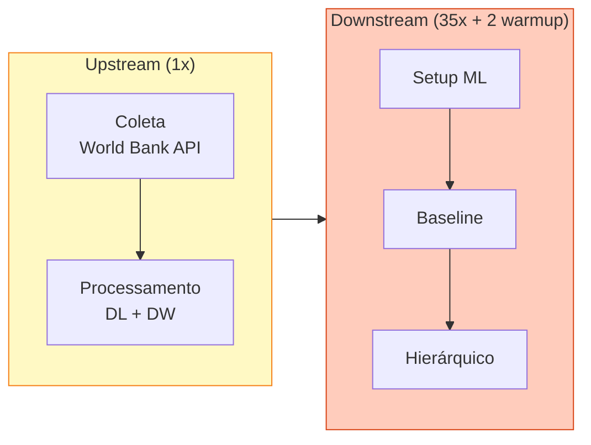
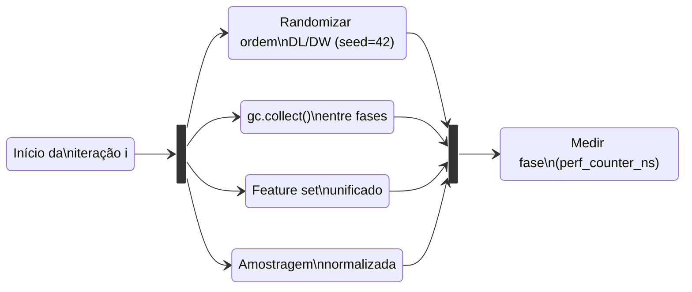
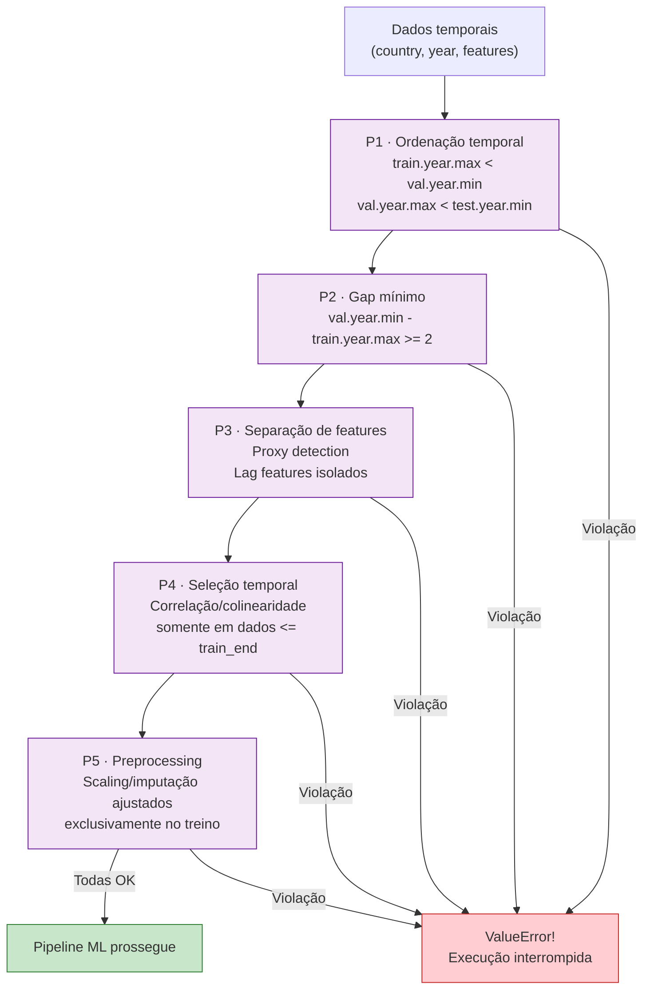
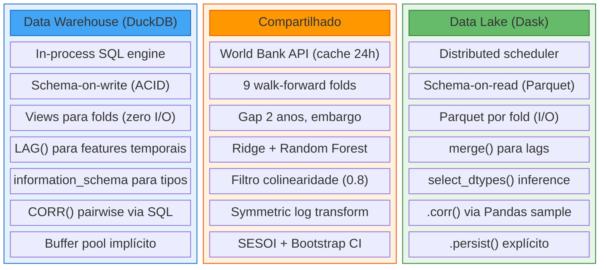

# Diagrama do Pipeline — Data Warehouse vs Data Lake

Documentação técnica do fluxo completo do framework de benchmarking reprodutível. Mostra ambos os paradigmas (DuckDB e Dask) em paralelo, a separação upstream/downstream, e as garantias de fairness implementadas.

## Visão geral

```mermaid
graph TB
    classDef configClass fill:#e1f5ff,stroke:#01579b,stroke-width:3px
    classDef collectionClass fill:#fff9c4,stroke:#f57f17,stroke-width:2px
    classDef dlClass fill:#c8e6c9,stroke:#2e7d32,stroke-width:2px
    classDef dwClass fill:#b3e5fc,stroke:#0277bd,stroke-width:2px
    classDef benchClass fill:#ffccbc,stroke:#d84315,stroke-width:2px
    classDef validationClass fill:#f3e5f5,stroke:#6a1b9a,stroke-width:2px
    classDef outputClass fill:#ffe0b2,stroke:#e65100,stroke-width:2px
    classDef fairnessClass fill:#e8eaf6,stroke:#283593,stroke-width:2px

    %% ============================================================
    %% UPSTREAM — executa UMA vez (run_id=0)
    %% ============================================================
    subgraph UPSTREAM ["UPSTREAM — execução única"]
        direction TB

        CONFIG[/"scientific_config.py\n• Seeds centralizadas\n• Gaps temporais (2a)\n• Limiares SESOI\n• Parâmetros de benchmark"/]:::configClass

        SNAPSHOT["Snapshot Científico\nscientific_config_snapshot.json\n• Timestamp + Git commit\n• Ambiente Python + Hardware"]:::configClass

        CONFIG --> SNAPSHOT

        COLLECT["FASE 1 · Coleta\nraw_data_collector.py\n• World Bank API\n• 32 países, 2000-2023\n• Cache local < 24h"]:::collectionClass

        SNAPSHOT --> COLLECT

        RAWDATA[("raw_data/\ncomplete_data.parquet")]:::collectionClass

        COLLECT --> RAWDATA

        subgraph PROC ["FASE 2 · Processamento Arquitetural"]
            direction LR

            subgraph DL_PROC_G ["Data Lake"]
                direction TB
                DL_PROC["processor.py\nDask · schema-on-read\n• Lazy evaluation\n• Parquet particionado"]:::dlClass
                DL_DATA[("data_lake/\nParquet")]:::dlClass
                DL_PROC --> DL_DATA
            end

            subgraph DW_PROC_G ["Data Warehouse"]
                direction TB
                DW_PROC["processor.py\nDuckDB · schema-on-write\n• SIMD vetorizado\n• SQL transacional"]:::dwClass
                DW_DATA[("data_warehouse/\nDuckDB + Parquet")]:::dwClass
                DW_PROC --> DW_DATA
            end
        end

        RAWDATA --> DL_PROC
        RAWDATA --> DW_PROC
    end

    %% ============================================================
    %% DOWNSTREAM — repete 35x (+ 2 warmup descartados)
    %% ============================================================
    subgraph DOWNSTREAM ["DOWNSTREAM — 35 repetições + 2 warmup"]
        direction TB

        FAIR["Fairness por iteração\n• Ordem DL/DW randomizada (seed=42)\n• gc.collect() entre fases\n• Feature set unificado"]:::fairnessClass

        subgraph SETUP_G ["FASE 3 · Setup ML"]
            direction LR

            BASE["BaseArchitectureML\n11 métodos abstratos\nTemplate Method\nEnforcement anti-leakage"]:::configClass

            subgraph DL_ML_G ["ML Data Lake"]
                direction TB
                DL_SETUP["setup.py · Dask\n• .persist() após read_parquet\n• Lags via merge()\n• Folds → Parquet"]:::dlClass
                DL_FOLDS[("temporal_folds_data_lake.json\nfeature_selection_data_lake.json")]:::dlClass
                DL_SETUP --> DL_FOLDS
            end

            subgraph DW_ML_G ["ML Data Warehouse"]
                direction TB
                DW_SETUP["setup.py · DuckDB\n• SQL views (zero I/O)\n• LAG() window functions\n• Folds → Views"]:::dwClass
                DW_FOLDS[("temporal_folds_data_warehouse.json\nfeature_selection_data_warehouse.json")]:::dwClass
                DW_SETUP --> DW_FOLDS
            end

            BASE -.-> DL_SETUP
            BASE -.-> DW_SETUP
        end

        FAIR --> SETUP_G

        GATE{"GATE ANTI-LEAKAGE\nTemporalValidator.enforce_walk_forward()\n• P1: Ordenação temporal\n• P2: Gap mínimo 2 anos\n• P3: Separação de features\n• P4: Seleção no escopo do treino\n• P5: Scaling/imputação só no treino\nraise ValueError se violado"}:::validationClass

        DL_FOLDS --> GATE
        DW_FOLDS --> GATE

        subgraph BASELINE_G ["FASE 4 · Modelos Baseline"]
            direction LR
            DL_BASE["baseline_analysis.py\nData Lake (.persist())\n• Média histórica\n• Tendência linear\n• Naive · Cross-country"]:::dlClass
            DW_BASE["baseline_analysis.py\nData Warehouse (SQL)\n• Média histórica\n• Tendência linear\n• Naive · Cross-country"]:::dwClass
        end

        GATE --> DL_BASE
        GATE --> DW_BASE

        subgraph HIER_G ["FASE 5 · Modelos Hierárquicos"]
            direction LR
            DL_HIER["hierarchical_models.py\nData Lake (.persist())\n• Ridge hierárquico\n• Random Forest\n• James-Stein shrinkage"]:::dlClass
            DW_HIER["hierarchical_models.py\nData Warehouse (SQL-first)\n• Ridge hierárquico\n• Random Forest\n• James-Stein shrinkage"]:::dwClass
        end

        DL_BASE --> DL_HIER
        DW_BASE --> DW_HIER
    end

    DL_DATA --> DL_SETUP
    DW_DATA --> DW_SETUP
    CONFIG --> BASE

    %% ============================================================
    %% BENCHMARK + VALIDAÇÃO
    %% ============================================================
    BENCH["FASE 6 · Benchmark Arquitetural\narchitectural_benchmark.py\n• perf_counter_ns()\n• psutil (CPU/RAM/I/O)\n• 35 repetições + 2 warmup\n• Ordem randomizada por iteração"]:::benchClass

    DL_HIER --> BENCH
    DW_HIER --> BENCH
    CONFIG --> BENCH

    BENCH_OUT[("benchmarks/\n• architectural_benchmark_results.csv\n• architectural_benchmark_resource_log.jsonl\n• architectural_benchmark_summary.json")]:::benchClass

    BENCH --> BENCH_OUT

    subgraph STATS_G ["FASE 7 · Validação Estatística"]
        direction TB
        EFFECT["effect_analysis.py\n• Cohen's dz pareado\n• Interpretação prática"]:::validationClass
        SIGNIF["significance_tests.py\n• Wilcoxon pareado\n• Bootstrap CI 95%\n• Hodges-Lehmann"]:::validationClass
        EQUIV["equivalence_estimation.py\n• TOST por bootstrap\n• SESOI: R²=0.01, MASE/WAPE=0.05\n• Sensibilidade 0.5x–1.5x"]:::validationClass
        SCORE["make_scorecard.py\n• Tabelas LaTeX\n• Métricas comparativas"]:::validationClass

        EFFECT --> SCORE
        SIGNIF --> SCORE
        EQUIV --> SCORE
    end

    BENCH_OUT --> EFFECT
    BENCH_OUT --> SIGNIF
    BENCH_OUT --> EQUIV

    FINAL_OUT[("statistics/\n• effect_sizes_summary.csv/json\n• significance_summary.csv/json\n• equivalence_estimation.json/tex\n• architectural_scorecard.tex")]:::outputClass

    SCORE --> FINAL_OUT

    VALIDATOR["benchmark_validator.py\n• Folds idênticos\n• Target diff < 1e-15\n• Predições equivalentes"]:::validationClass

    DL_FOLDS --> VALIDATOR
    DW_FOLDS --> VALIDATOR
    VALIDATOR --> FINAL_OUT
```



## Separação upstream / downstream

O benchmark separa o pipeline em duas camadas com justificativas distintas:



**Upstream** — coleta e processamento produzem dados determinísticos idênticos em toda execução. Repetí-los N vezes apenas desperdiça tempo com chamadas HTTP e I/O sem adicionar informação estatística. O cache local (`_cache_is_valid()`) evita chamadas redundantes à API do World Bank quando os dados já existem e têm menos de 24 horas.

**Downstream** — setup, baseline e hierarchical contêm a lógica arquitetural que diferencia DW e DL. São o alvo real do benchmark e por isso são repetidos N vezes para poder derivar intervalos de confiança e effect sizes.

## Garantias de fairness no benchmark



Cada iteração do benchmark aplica 4 controles de fairness:

**Ordem randomizada** — a cada iteração, `random.Random(42)` decide se DL ou DW executa primeiro. Elimina viés sistemático de OS page cache onde uma arquitetura sempre se beneficiaria do I/O prévio da outra. O seed é fixo para reprodutibilidade.

**gc.collect()** — garbage collection forçado entre cada execução de arquitetura e entre fases. Evita que objetos Python residuais de uma arquitetura fiquem em memória beneficiando ou prejudicando a próxima.

**Feature set unificado** — lag features (`dropout_rate_lag_2/3`) são excluídas do `get_numeric_features()` em ambas as arquiteturas. O DL as criava em `create_target_implementation` (antes do filtro de colinearidade) e o DW só as criava em `prepare_features` (depois), gerando conjuntos iniciais de 23 vs 21 features. Agora ambos entram com o mesmo conjunto base no filtro.

**Amostragem normalizada** — o filtro de colinearidade do DW aplicava `IS NOT NULL` apenas nas primeiras 10 features antes de amostrar. Agora filtra em todas as features candidatas, equivalente ao `.dropna()` que o DL faz. Ambos computam a matriz de correlação sobre a mesma população de linhas completas.

## Protocolo anti-leakage (P1-P5)



O gate valida cada fold individualmente antes de liberar para os modelos. Cobre as categorias L1.1-L1.4, L2 e L3.2-L3.3 da taxonomia de Kapoor & Narayanan (2023). P1-P4 geram `ValueError` em runtime; P5 é enforced por contrato e testes unitários. A injeção de leakage (`test_leakage_injection.py`, cenários S1-S4) verifica que o gate detecta violações deliberadas.

## Comparação arquitetural



## Resultados de referência (Azure L4as_v4, 32 GB RAM, n=35)

```mermaid
xychart-beta
    title "Latência por fase (segundos)"
    x-axis ["Setup", "Processing", "Baseline", "Hierarchical"]
    y-axis "Tempo (s)" 0 --> 200
    bar [0.39, 0.16, 1.19, 15.23]
    bar [177.28, 0.79, 7.71, 16.92]
```



| Fase | DuckDB (s) | Dask (s) | Ratio | Cohen's dz |
|------|-----------|---------|-------|-----------|
| Setup (n=35) | 0.39 ± 0.04 | 177.28 ± 0.08 | **452x** | 704.2 |
| Processing (n=1) | 0.16 | 0.79 | **5x** | — |
| Baseline (n=35) | 1.19 ± 0.00 | 7.71 ± 0.00 | **6x** | 441.0 |
| Hierarchical (n=35) | 15.23 ± 0.01 | 16.92 ± 0.01 | **1.1x** | 47.0 |
| **Total** | **16.97** | **202.70** | **12x** | — |

Ambiente: Azure Standard_L4as_v4 (4 vCPUs, 32 GB RAM, NVMe), Ubuntu 22.04, Python 3.10. IC 95% via t-distribution. Processing executa uma vez (upstream); demais fases repetidas 35 vezes com 2 warmup descartados. Ordem DL/DW randomizada por iteração com `gc.collect()` entre execuções.

## Legenda

### Código de cores

- **Azul claro** — configuração e reprodutibilidade
- **Amarelo** — coleta de dados brutos (upstream)
- **Verde** — pipeline Data Lake (Dask)
- **Azul** — pipeline Data Warehouse (DuckDB)
- **Laranja** — benchmarking e instrumentação
- **Roxo** — validação estatística e anti-leakage
- **Índigo** — controles de fairness

### Estrutura de outputs

```
outputs/
├── scientific_config_snapshot.json
├── collection/
│   ├── raw_data/                          # Dados brutos do Banco Mundial
│   ├── data_lake/                         # Parquet particionado (Dask)
│   └── data_warehouse/                    # DuckDB + Parquet
├── ml_pipeline/
│   └── architectures/
│       ├── data_lake/prep/                # Folds, features, modelos DL
│       └── data_warehouse/prep/           # Folds, features, modelos DW
├── benchmarks/
│   ├── architectural_benchmark_results.csv
│   ├── architectural_benchmark_resource_log.jsonl
│   └── architectural_benchmark_summary.json
└── statistics/
    ├── effect_sizes_summary.csv/json
    ├── significance_summary.csv/json/md
    ├── equivalence_estimation.json/tex
    └── architectural_scorecard.tex
```

### Execução

```bash
# Pipeline completo (7 fases)
python pipeline.py

# Repetições e warmup configurados em scientific_config.py
# (padrão: 35 repetições downstream + 2 warmup descartados)
python pipeline.py
```
